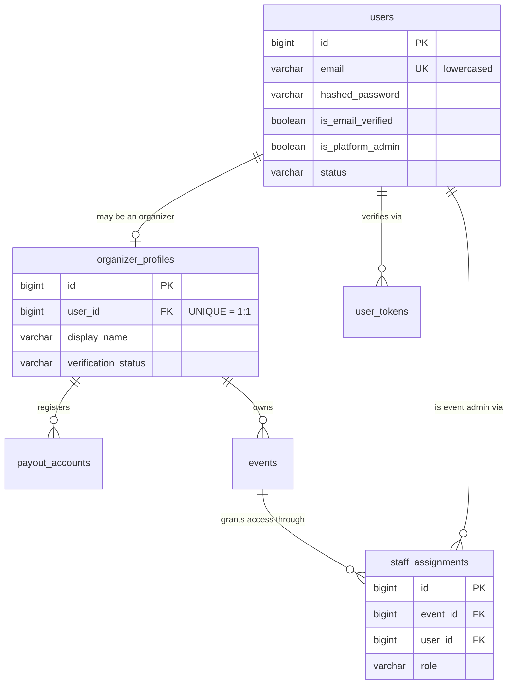

← [Index](README.md) · Next: [02 — Events and inventory](02-events.md)

# 01 — Identity, Roles, and Access

**Tables:** `users`, `organizer_profiles`, `payout_accounts`,
`staff_assignments`, `user_tokens`
**Depends on:** nothing — this is the first slice
**SRS:** §4.1, §1.3, §3.2, §4.8, §4.12 · **Week:** 3–4

---

## What this slice is for

Who someone is, and what they're allowed to do.

The important idea is in the [index](README.md#roles-are-relationships-not-a-column)
and worth repeating: **only Platform Admin is a global role.** Organizer and
Event Admin are *relationships to an event*, stored as rows in
`organizer_profiles` and `staff_assignments`. There is no `users.role` column,
and adding one later is the most likely way this design gets broken.

---

## Diagram



---

## `users`

Every human with an account. Attendees, organizers, event admins, and platform
admins are all rows in this one table.

| Column | Type | Null | Notes |
|---|---|---|---|
| `id` | bigint PK | no | |
| `email` | varchar(320) | no | **UNIQUE.** Stored lowercased — see below |
| `hashed_password` | varchar | no | No length limit; argon2 hashes are long |
| `first_name` | varchar(100) | no | Given name — *аты* / *имя* |
| `last_name` | varchar(100) | no | Surname — *тегі* / *фамилия* |
| `phone` | varchar(32) | yes | |
| `is_email_verified` | boolean | no | default `false` (§4.1) |
| `is_platform_admin` | boolean | no | default `false`. The only global role |
| `status` | varchar | no | `active` \| `suspended` (§4.12) |
| `locale` | varchar(5) | no | default `'ru'`. §7: kk, ru, en |
| `created_at`, `updated_at` | timestamptz | no | |

```sql
CONSTRAINT ck_users_status CHECK (status IN ('active','suspended'))
```

### Why email is lowercased

Postgres string comparison is case-sensitive. `Nurali@x.com` and
`nurali@x.com` would become **two separate accounts** under a plain unique
constraint, and the second person to sign up would be silently locked out of
the first one's tickets.

Normalize to lowercase on write, before validation. Fixing this after launch
means a data migration over live accounts with real duplicates to merge — which
is much worse than it sounds.

### Why the password column is named `hashed_password`

So that nobody is ever tempted to put a plaintext password in it. §7 requires
"secure password hashing." The name is the documentation.

### Why the name is two columns, not one

Splitting on write is easy; splitting on read is guesswork. A single
`full_name` forces every consumer that needs just the surname — a check-in list
sorted by surname, an alphabetical attendee export, a "Dear Aigerim" email — to
split the string itself, and every one of them will split it differently.
`"Aigerim Nurlanovna Sadykova"` has no reliable rule for which token is the
surname.

Two columns move that decision to the one moment it can actually be answered:
when the person types their own name.

**Do not add a stored `full_name`.** Derive it for display. This follows the
same rule as the derived event states in
[state-machines.md §1.1](../state-machines.md) — a value computed from two
columns is not a third column, because the two can then disagree.

Display order is also **not** a database concern. §7 requires kk, ru, and en,
and official Kazakh and Russian documents put the surname first (*Сәдықова
Айгерім*) where English UI puts it last (*Aigerim Sadykova*). Concatenating in
SQL bakes one locale's order into every screen. Store the parts; let the
presentation layer join them.

### What this rules out, deliberately

- **No `middle_name` / patronymic column.** Kazakh and Russian identity
  documents carry an *әкесінің аты* / *отчество*, so this is a real omission,
  not an oversight. The MVP never has to match a ticket against an ID document
  — §4.7 admits people by signed QR, not by name — so the column would be
  collected and never read. Add it if and only if a requirement appears that
  reads it.
- **Both parts are `NOT NULL`.** Mononyms exist, and this design cannot
  represent one. That is an accepted limitation for a platform whose users all
  hold KZ documents with both fields. The escape hatch, if it is ever needed, is
  relaxing `last_name` to nullable — which is a cheap migration in the direction
  that stays cheap.

---

## `organizer_profiles`

One-to-one with `users`. A user becomes an organizer by gaining a row here.

| Column | Type | Null | Notes |
|---|---|---|---|
| `id` | bigint PK | no | |
| `user_id` | bigint FK → `users` | no | **UNIQUE** — this is what makes it 1:1 |
| `display_name` | varchar(200) | no | Public-facing organizer name |
| `contact_email` | varchar(320) | no | §4.1. May differ from the login email |
| `contact_phone` | varchar(32) | yes | |
| `description` | text | yes | |
| `verification_status` | varchar | no | `unverified` \| `pending` \| `verified` \| `rejected` (§3.2) |
| `created_at`, `updated_at` | timestamptz | no | |

### Why this is a separate table and not columns on `users`

Most users are never organizers. Putting `display_name`,
`verification_status`, and payout links on `users` would leave those columns
`NULL` for the overwhelming majority of rows, and would make "is this person an
organizer?" a question about whether some column happens to be filled in —
which is not a question with a reliable answer.

With a separate table it's a join that either finds a row or doesn't.

`verification_status = 'verified'` is one of the five preconditions for paid
sales (§3.2) — see [02-events.md](02-events.md#event_activations).

---

## `payout_accounts`

Where an organizer would be paid, if this were real money.

| Column | Type | Null | Notes |
|---|---|---|---|
| `id` | bigint PK | no | |
| `organizer_profile_id` | bigint FK | no | |
| `provider` | varchar | no | |
| `external_account_ref` | varchar | no | Opaque reference from the provider |
| `status` | varchar | no | `pending` \| `active` \| `rejected` (§3.2) |
| `is_simulated` | boolean | no | §3.2 — must be visibly fake |
| `created_at` | timestamptz | no | |

### No bank details are ever stored

§7: "Payment-card data shall not be stored directly by the platform." Only the
provider's opaque reference. There is no `iban`, no `card_number`, no
`account_holder` column here, and none should be added.

`is_simulated` exists because §3.2 requires the academic MVP's payouts to be
"clearly labelled simulation." A column makes that enforceable in the UI rather
than a promise in a document.

---

## `staff_assignments`

Which users may scan tickets for which events. This one small table is the whole
answer to §4.8's "view only assigned events."

| Column | Type | Null | Notes |
|---|---|---|---|
| `id` | bigint PK | no | |
| `event_id` | bigint FK → `events` | no | |
| `user_id` | bigint FK → `users` | no | |
| `role` | varchar | no | `event_admin`. Room for `organizer_staff` later |
| `assigned_by_user_id` | bigint FK → `users` | no | §4.16 audit trail |
| `created_at` | timestamptz | no | |

```sql
CONSTRAINT uq_staff_assignments_event_id_user_id UNIQUE (event_id, user_id)
```

### Why `assigned_by_user_id`

§4.16 requires the event timeline to record "acting user" for important actions.
Granting someone the ability to check attendees in is exactly such an action. It
costs one column now and is unreconstructable later.

---

## `user_tokens`

Email verification and password reset. §4.1 requires both. Not listed among
§6's core entities, but the features are mandatory, so the table is.

| Column | Type | Null | Notes |
|---|---|---|---|
| `id` | bigint PK | no | |
| `user_id` | bigint FK | no | |
| `purpose` | varchar | no | `email_verification` \| `password_reset` |
| `token_hash` | varchar | no | **UNIQUE. A hash, never the token** |
| `expires_at` | timestamptz | no | |
| `used_at` | timestamptz | yes | Single-use — set on redemption |
| `created_at` | timestamptz | no | |

### Why a hash and not the token

**A password-reset token is a temporary password.** If the database leaks and
tokens are stored in plaintext, an attacker takes over every account with a
pending reset — no password cracking required.

Store `sha256(token)`. A fast hash is correct here, unlike for passwords: the
token is already high-entropy random bytes, so there is nothing to brute-force
and no reason to pay argon2's cost on every verification click.

Send the raw token in the email, keep only the hash. You can never display the
token again — which is the intended behaviour.

### Why one table instead of two

The two purposes have identical columns and identical lifecycles. Two tables
would be the same schema twice, and every "expire old tokens" job would have to
know about both.

---

## How they connect

- A `users` row stands alone. Most users have nothing else in this slice.
- Add an `organizer_profiles` row → that user can create events.
- Add `payout_accounts` under that profile → one precondition for paid sales.
- Add a `staff_assignments` row → that user can scan tickets **for one event**.
- `user_tokens` are transient; they exist between "click sign up" and "click the
  link," then stay as spent rows.

Note the direction: `events.organizer_profile_id` points at
`organizer_profiles`, **not** at `users`. Events are owned by the organizer
identity, not the login.

---

## The permission matrix

What the backend enforces, and what the frontend should reflect.

| Question | How it is answered |
|---|---|
| Can they log in? | `users.status = 'active'` |
| Can they buy a ticket? | Anyone. Including no account at all (guest checkout) |
| Can they create an event? | An `organizer_profiles` row exists |
| Can they edit **this** event? | `events.organizer_profile_id` belongs to them |
| Can they scan for **this** event? | A `staff_assignments` row for `(event_id, user_id)` |
| Can they moderate anything? | `users.is_platform_admin` |

Every event-scoped check is a lookup keyed on `event_id`, never a role string.

---

## For the frontend

**What the API exposes**

- `/users/me` returns the current user. There is no `/users/{id}` — user IDs are
  never accepted from the client, so don't build a UI that needs one.
- The token identifies the user. Never send a user ID to prove who you are.
- Whether someone is an organizer is **not a field on the user object**. Expect
  the API to return the organizer profile (or its absence) and the list of
  events they're assigned to. Don't cache "role" in client state and branch on
  it — a user can be an organizer of one event and an attendee at another on the
  same screen.

**Validation to mirror client-side** (the server enforces all of it anyway)

| Field | Rule |
|---|---|
| `email` | Valid address; **lowercase it before sending** so the client and server agree on identity |
| `first_name` | Required, ≤ 100 chars, trimmed |
| `last_name` | Required, ≤ 100 chars, trimmed |
| `password` | Minimum length agreed by the team; never sent anywhere but the auth endpoints |
| `locale` | One of `kk`, `ru`, `en` (§7) |

**Gotchas**

- An unverified user can sign in but should be nudged to verify
  (`is_email_verified`). Decide together which actions are gated on it.
- Reset and verification links are **single-use and expiring**. The UI needs a
  clean "this link has expired, request a new one" state — not a generic error.
- Suspended users (§4.12) need a distinguishable message from wrong-password.
  Not so distinguishable that it leaks account existence to strangers.

**Mobile app specifically**

The Event Admin app (§4.8) shows "only assigned events." That list comes from
`staff_assignments`, so it can be empty and legitimately so — a signed-in admin
with no assignments is a normal state, not an error. Design that empty screen.

---

## Build checklist

- [ ] `app/models/user.py` — `users`
- [ ] `app/models/organizer.py` — `organizer_profiles`, `payout_accounts`
- [ ] `app/models/staff.py` — `staff_assignments`
- [ ] `app/models/token.py` — `user_tokens`
- [ ] Import **every one** of them in `app/db/base.py`
- [ ] `alembic revision --autogenerate -m "identity"` — then **read the file**
- [ ] `alembic upgrade head`, then `downgrade -1`, then upgrade again
- [ ] `app/core/security.py` — password hashing (pwdlib/argon2), JWT sign/verify
- [ ] `app/api/deps.py` — `get_current_user`, and event-scoped permission helpers
- [ ] Tests: email case-insensitivity, token single-use, token expiry,
      suspended user cannot log in, and each row of the permission matrix

`staff_assignments.event_id` references `events`, which doesn't exist yet.
Either put this slice's migration after [02](02-events.md), or split
`staff_assignments` into the 02 migration. **Recommended:** build 01 without
`staff_assignments`, then add it with 02 — it belongs to the event, not the user.

---

← [Index](README.md) · Next: [02 — Events and inventory](02-events.md)
