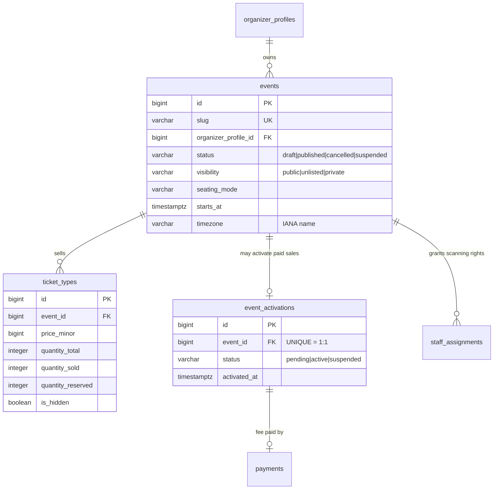

← [01 — Identity](01-identity.md) · [Index](README.md) · Next: [03 — Ordering](03-ordering.md)

# 02 — Events and Inventory

**Tables:** `events`, `ticket_types`, `event_activations`
**Depends on:** [01 — Identity](01-identity.md)
**SRS:** §4.2, §4.3, §4.5, §3.1, §3.2, §4.16 · **Week:** 3–5

---

## What this slice is for

What is being sold, when, where, and whether the organizer is allowed to take
money for it.

Two ideas drive the shape here:

1. **An event's lifecycle and its visibility are separate things.** A published
   event can still be private.
2. **`ticket_types` holds the inventory counters**, and those counters are the
   thing that concurrent buyers fight over. The constraints on this table are
   load-bearing — see [concurrency.md](concurrency.md).

---

## Diagram



---

## `events`

| Column | Type | Null | Notes |
|---|---|---|---|
| `id` | bigint PK | no | |
| `slug` | varchar(200) | no | **UNIQUE.** §4.11 stable URL |
| `organizer_profile_id` | bigint FK | no | Owned by the profile, not the user |
| `title` | varchar(300) | no | §4.2 |
| `description` | text | yes | §4.2 |
| `category` | varchar(64) | yes | §4.2 |
| `cover_image_url` | varchar | yes | §4.2 images |
| `status` | varchar | no | `draft` \| `published` \| `cancelled` \| `suspended` |
| `visibility` | varchar | no | `public` \| `unlisted` \| `private` (§4.2) |
| `seating_mode` | varchar | no | `general_admission` \| `assigned` (§4.3.1) |
| `venue_name` | varchar(300) | no | §4.11 needs it for the `.ics` |
| `venue_address` | text | no | §4.11 needs it for the `.ics` |
| `venue_id` | bigint FK | yes | Bonus seating only — [08](08-seating-bonus.md) |
| `starts_at` | timestamptz | no | |
| `ends_at` | timestamptz | no | §4.11 calendar entries need an end |
| `timezone` | varchar(64) | no | **IANA name**, e.g. `'Asia/Almaty'` |
| `capacity` | integer | yes | §4.2 overall cap |
| `registration_opens_at` | timestamptz | yes | §4.2 |
| `registration_closes_at` | timestamptz | yes | §4.2 |
| `published_at` | timestamptz | yes | |
| `cancelled_at` | timestamptz | yes | |
| `created_at`, `updated_at` | timestamptz | no | |

```sql
CONSTRAINT ck_events_status
    CHECK (status IN ('draft','published','cancelled','suspended')),
CONSTRAINT ck_events_visibility
    CHECK (visibility IN ('public','unlisted','private')),
CONSTRAINT ck_events_seating_mode
    CHECK (seating_mode IN ('general_admission','assigned')),
CONSTRAINT ck_events_ends_after_starts
    CHECK (ends_at > starts_at)
```

Index: `(status, visibility, starts_at)` — the public event-discovery query
filters on exactly those three.

### Why `status` and `visibility` are separate columns

They answer different questions:

- `status` — where is this in its lifecycle? *(draft → published → cancelled)*
- `visibility` — who can find it? *(public / unlisted / private)*

§4.2 requires both, and they combine freely: a **published private** event is
live and sellable but only reachable by direct link. Collapsing them into one
column makes that state unrepresentable, and you would discover it in week 6.

### Why `timezone` is stored even though `starts_at` is `TIMESTAMPTZ`

A `TIMESTAMPTZ` stores **an instant**, not a place. It can tell you the concert
happens at `2026-11-30T14:00:00Z`. It cannot tell you the organizer meant
*"7pm, Almaty time"* — and §4.11 requires the `.ics` export to carry exactly
that.

Store the **IANA name**, never a UTC offset. Kazakhstan consolidated to a single
UTC+5 zone in March 2024: a stored `+06:00` would have silently become wrong,
while `'Asia/Almaty'` stayed correct because the tz database was updated.

### Upcoming / Active / Completed are NOT columns

§4.16 asks the dashboard to classify events as Upcoming, Active, Completed, or
Cancelled. Only `cancelled` is stored. The rest are derived:

| Label | Condition |
|---|---|
| Upcoming | `status='published' AND starts_at > now()` |
| Active | `status='published' AND starts_at <= now() <= ends_at` |
| Completed | `status='published' AND ends_at < now()` |
| Cancelled | `status='cancelled'` |

Storing them would require a scheduled job to keep them true, and they would be
wrong in between runs. **Never store what the clock can tell you.**

Full lifecycle: [state-machines.md §1](../state-machines.md#1-event).

---

## `ticket_types`

What's for sale, at what price, and how many are left. §4.3.

| Column | Type | Null | Notes |
|---|---|---|---|
| `id` | bigint PK | no | |
| `event_id` | bigint FK | no | |
| `name` | varchar(200) | no | "Early Bird", "VIP" |
| `description` | text | yes | |
| `price_minor` | bigint | no | default `0`. **`0` means free** (§3.1) |
| `currency` | char(3) | no | default `'KZT'` |
| `quantity_total` | integer | no | §4.3 |
| `quantity_sold` | integer | no | default `0` |
| `quantity_reserved` | integer | no | default `0`. Live holds |
| `sales_start_at` | timestamptz | yes | §4.3 |
| `sales_end_at` | timestamptz | yes | §4.3 |
| `max_per_order` | integer | yes | §4.3 per-order limit |
| `is_hidden` | boolean | no | default `false`. §4.3 "hide without deleting" |
| `position` | integer | no | default `0`. Display order |
| `created_at`, `updated_at` | timestamptz | no | |

```sql
CONSTRAINT ck_ticket_types_inventory_within_total
    CHECK (quantity_sold + quantity_reserved <= quantity_total),
CONSTRAINT ck_ticket_types_counters_non_negative
    CHECK (quantity_sold >= 0 AND quantity_reserved >= 0),
CONSTRAINT ck_ticket_types_price_non_negative
    CHECK (price_minor >= 0)
```

### The first constraint is the one that matters

`ck_ticket_types_inventory_within_total` is the **last line of defence against
overselling**. It is not decoration and it is not optional.

Measured on this project's Postgres 17: with 20 buyers racing for the last 5 of
100 tickets, naive application code sold **115**. The same naive code with this
constraint in place sold exactly 100. See
[concurrency.md](concurrency.md) for the full numbers and the correct
application-side pattern.

### Why free is `price_minor = 0` and not a boolean

§3.1 and §3.2 make "free" a property of the price, not a separate mode: a single
event can have both free and paid ticket types, and §3.2's activation applies to
the event because it has *at least one* paid type. A `is_free` boolean would let
`is_free = true, price_minor = 5000` exist, which is a bug waiting to be written.

Free vs paid is `price_minor = 0`. One source of truth.

### Why `is_hidden` instead of deleting

§4.3: "Hide ticket types without deleting them." Deleting is impossible anyway
once a ticket has been sold against it — `order_items` and `tickets` reference
it, and §4.16 requires completed events to retain their records.

---

## `event_activations`

Whether this event may take money. §4.5. One row per event, at most.

| Column | Type | Null | Notes |
|---|---|---|---|
| `id` | bigint PK | no | |
| `event_id` | bigint FK | no | **UNIQUE** — 1:1 with the event |
| `status` | varchar | no | `pending` \| `active` \| `suspended` |
| `activation_fee_minor` | bigint | no | §3.3 |
| `currency` | char(3) | no | default `'KZT'` |
| `payment_id` | bigint FK → `payments` | yes | The fee payment |
| `terms_accepted_at` | timestamptz | yes | §3.2 step 5 |
| `activated_at` | timestamptz | yes | |
| `suspended_at` | timestamptz | yes | §4.5 |
| `suspended_by_user_id` | bigint FK → `users` | yes | |
| `suspension_reason` | text | yes | |
| `created_at`, `updated_at` | timestamptz | no | |

### Why a separate table instead of columns on `events`

§4.12 requires Platform Admins to "inspect paid-sales activation records." That
is a record with its own lifecycle, its own audit fields, and its own payment
reference. Nine mostly-`NULL` columns on `events` — which for free events would
*always* be `NULL`, and §3.1 says free events are the default — would be worse.

### Activation is per-event, not per-organizer

§4.5: "Activation shall apply only to the selected event." An organizer who ran
one paid event must activate again for the next one. That's a business rule
(each activation is a fee), and it's why this is a row per event rather than a
flag on `organizer_profiles`.

### The five preconditions

§3.2 lists them, and all five must hold before `status` can become `active`:

1. The event has at least one paid ticket type (`price_minor > 0`)
2. `organizer_profiles.verification_status = 'verified'`
3. The activation-fee `payments` row is `succeeded`
4. A `payout_accounts` row is `active`
5. `terms_accepted_at` is set

Enforce this in one place. See
[state-machines.md §2](../state-machines.md#2-paid-sales-activation).

---

## How they connect

- An `organizer_profiles` row owns many `events`.
- An `events` row has many `ticket_types` — at least one before it can publish.
- An `events` row has at most one `event_activations`, and only needs one if it
  sells a paid ticket type.
- `staff_assignments` (defined in [01](01-identity.md)) hangs off `events`. If
  you deferred it, this is the migration it belongs in.
- Everything in [03 — Ordering](03-ordering.md) points back here.

**Free events touch none of `event_activations` or `payments`.** §3.1 guarantees
the whole free flow costs the organizer nothing, so the free path must work with
those tables completely empty. Build and test that path first — it is the
shortest route to a working demo.

---

## For the frontend

**Event states you must render**

Six visible combinations, and they are not interchangeable:

| Backend state | What the attendee sees | What the organizer sees |
|---|---|---|
| `draft` | Nothing — 404 | Editable, with a Preview action (§4.2) |
| `published` + `public` | Listed and reachable | Live, with sales figures |
| `published` + `unlisted` | Reachable by link, not listed | Live, plus a "share this link" affordance |
| `published` + `private` | Reachable by link only | Live |
| `suspended` | Sales stopped (§4.12) | A clear reason from `suspension_reason` |
| `cancelled` | Cancelled notice, tickets void | Read-only history (§4.16) |

**Times and timezones — the part that goes wrong**

The API sends UTC instants plus `event.timezone`. **Render event times in the
event's timezone, not the viewer's.** A concert in Almaty starts at 7pm Almaty
time whether you're reading the page from Astana or Berlin. Showing a
browser-local conversion is the single most common bug in event UIs.

Label it explicitly — "19:00 (Almaty)" — so nobody has to guess.

**Ticket type display**

- `price_minor = 0` → render as "Free", not "₸0".
- `price_minor` is in **minor units**. Divide by 100 for display; never do money
  arithmetic in floating point.
- `is_hidden = true` → do not render to attendees at all. Organizers still see it.
- Sort by `position`, then `id`.
- Availability is `quantity_total - quantity_sold - quantity_reserved`. Do **not**
  compute a "sold out" state from a stale page — the server decides at checkout
  and can return `409` even when the page said seats were free. Design that error
  state; it will happen.

**Sales windows**

A ticket type is buyable only when `now()` is inside `sales_start_at` /
`sales_end_at` *and* inside the event's `registration_opens_at` /
`registration_closes_at`. Two windows, both optional, both enforced server-side.
The UI should explain *which* one closed rather than greying out a button with
no reason.

**Paid sales gating**

If an event has a paid ticket type and its activation isn't `active`, checkout
returns an error (§4.5). Organizers need the activation checklist UI showing
which of the five preconditions are outstanding — that's a real screen, not an
error toast.

---

## Build checklist

- [ ] `app/models/event.py` — `events`
- [ ] `app/models/ticket_type.py` — `ticket_types` with all three CHECK constraints
- [ ] `app/models/activation.py` — `event_activations`
- [ ] `app/models/staff.py` — `staff_assignments`, if deferred from 01
- [ ] Import all of them in `app/db/base.py`
- [ ] `alembic revision --autogenerate -m "events and inventory"` — **read it**
- [ ] Verify the CHECK constraints reached the migration. Autogenerate is
      unreliable about these; if they're missing, add them by hand
- [ ] Prove the constraint works: try `UPDATE ticket_types SET quantity_sold =
      quantity_total + 1` in `psql` and confirm Postgres refuses
- [ ] Derived-status helper for Upcoming/Active/Completed — with the clock frozen
      in its tests
- [ ] Tests: publish guard (≥1 ticket type), `ends_at > starts_at`, timezone
      round-trip through `.ics`, activation's five preconditions

---

← [01 — Identity](01-identity.md) · [Index](README.md) · Next: [03 — Ordering](03-ordering.md)
