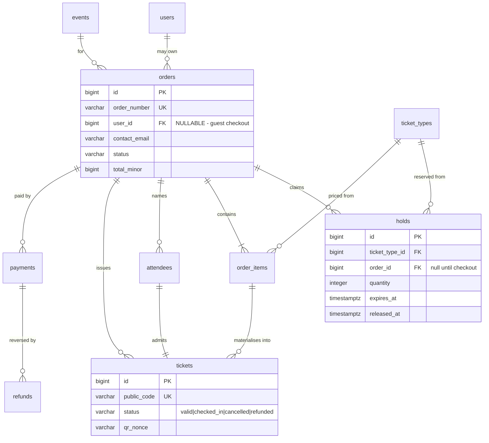

← [02 — Events](02-events.md) · [Index](README.md) · Next: [04 — Check-in](04-checkin.md)

# 03 — Ordering and Ticket Issuance

**Tables:** `holds`, `orders`, `order_items`, `attendees`, `tickets`,
`payments`, `refunds`
**Depends on:** [01 — Identity](01-identity.md), [02 — Events](02-events.md)
**SRS:** §4.4, §4.6, §4.7, §4.9 · **Week:** 5–6

> **Read [concurrency.md](concurrency.md) first.** This slice is where the
> overselling problem lives, and the rest of this file assumes you know the
> mechanism.

---

## What this slice is for

Turning "I want two tickets" into two QR codes, without selling the same seat
twice and without issuing a ticket for a payment that never landed.

This is the largest slice and the heart of the demo. Four ideas shape it:

1. **Inventory is claimed before payment**, through a `holds` row that expires.
2. **Tickets are issued only on confirmation** — §4.6 is explicit.
3. **Prices are snapshotted onto the order**, never read back from `ticket_types`.
4. **Guests can buy** — `orders.user_id` is nullable.

---

## Diagram



---

## `holds`

The concurrency primitive. A claim on inventory that expires by itself.

| Column | Type | Null | Notes |
|---|---|---|---|
| `id` | bigint PK | no | |
| `order_id` | bigint FK → `orders` | **yes** | `NULL` until checkout begins |
| `ticket_type_id` | bigint FK | no | |
| `event_seat_id` | bigint FK | yes | Bonus seating. `NULL` all term |
| `quantity` | integer | no | |
| `expires_at` | timestamptz | no | **Indexed** — the sweeper scans it |
| `released_at` | timestamptz | yes | Set on expiry, abandonment, or conversion |
| `created_at` | timestamptz | no | |

```sql
CONSTRAINT ck_holds_seat_is_single
    CHECK (event_seat_id IS NULL OR quantity = 1),
CONSTRAINT ck_holds_quantity_positive
    CHECK (quantity > 0)
```

### One table, both inventory models

A hold is either *"N units of a ticket type"* (general admission) or *"this one
specific seat"* (assigned). `event_seat_id` distinguishes them and stays `NULL`
for the entire term.

**This is why seating is an additive change later.** When [08](08-seating-bonus.md)
lands, `event_seat_id` starts being populated and `orders`, `order_items`, and
`tickets` **do not change** — which is the whole point, because by week 9 those
tables will contain demonstration data.

### Hold state is derived, not stored

There is no `status` column. State comes from two timestamps:

| State | Condition |
|---|---|
| active | `released_at IS NULL AND expires_at > now()` |
| converted | `released_at IS NOT NULL`, order confirmed |
| expired / released | `released_at IS NOT NULL`, order not confirmed |

Creating a hold is the atomic `UPDATE` from
[concurrency.md](concurrency.md#general-admission--one-atomic-statement). If
`rowcount = 0`, no hold row is created and checkout returns `409`.

---

## `orders`

| Column | Type | Null | Notes |
|---|---|---|---|
| `id` | bigint PK | no | |
| `order_number` | varchar(32) | no | **UNIQUE.** §4.13, human-quotable |
| `event_id` | bigint FK | no | |
| `user_id` | bigint FK → `users` | **yes** | **Guest checkout** — see below |
| `contact_email` | varchar(320) | no | Always set, even for guests |
| `contact_name` | varchar(200) | no | |
| `contact_phone` | varchar(32) | yes | |
| `status` | varchar | no | See [state-machines.md §4](../state-machines.md#4-order) |
| `subtotal_minor` | bigint | no | Before discount |
| `discount_minor` | bigint | no | default `0` (§4.14) |
| `fee_minor` | bigint | no | default `0`. §4.6 processing charges |
| `total_minor` | bigint | no | What was actually charged |
| `currency` | char(3) | no | default `'KZT'` |
| `campaign_id` | bigint FK | yes | §4.14 attribution |
| `expires_at` | timestamptz | yes | Checkout window |
| `confirmed_at` | timestamptz | yes | |
| `cancelled_at` | timestamptz | yes | |
| `created_at`, `updated_at` | timestamptz | no | |

Status values: `pending`, `confirmed`, `cancelled`, `refunded`,
`partially_refunded`, `expired`.

Index: `(event_id, status, created_at)` — powers the organizer's attendee list
and the §4.15 sales-over-time chart.

### `user_id` is nullable — guests can buy

The SRS points this way in three independent places:

- **UC3** precondition requires only that sales are open. Contrast **UC1**, which
  explicitly requires a *verified organizer account*. The difference is deliberate.
- **§10 Assumptions:** attendees have "email **or** an online account."
- **§11 Success criteria:** an attendee completes checkout and receives a ticket —
  no account mentioned.

Guests retrieve tickets through a **signed link** emailed to `contact_email`.

**Consequence, and it's a real one: every "my orders" lookup has two paths** —
owner (`user_id` matches the token) and token (signed link). Both need
authorization tests. This is the most likely place in the project to leak someone
else's order.

Still open ([README §Open questions](README.md#open-questions) #2): if a guest
later registers with the same email, do their past orders become theirs? Decide
deliberately. Don't let it happen by accident.

---

## `order_items`

One line per ticket type purchased.

| Column | Type | Null | Notes |
|---|---|---|---|
| `id` | bigint PK | no | |
| `order_id` | bigint FK | no | |
| `ticket_type_id` | bigint FK | no | |
| `event_seat_id` | bigint FK | yes | §4.3.1 — seat recorded on the item |
| `quantity` | integer | no | |
| `unit_price_minor` | bigint | no | **Snapshot** — see below |
| `discount_minor` | bigint | no | default `0` |
| `subtotal_minor` | bigint | no | |

```sql
CONSTRAINT ck_order_items_seat_is_single
    CHECK (event_seat_id IS NULL OR quantity = 1)
```

### `unit_price_minor` is a deliberate copy

It duplicates `ticket_types.price_minor`. **This is not denormalization for
speed — it is correctness.**

An organizer may change a ticket price; §4.16 explicitly requires the timeline to
log "ticket price changes." If a receipt joined to `ticket_types` for the price,
**every past order would silently rewrite itself** the moment the organizer
edited the price. Someone who paid ₸3,000 would see ₸5,000 on their receipt.

> **A financial record must never be recomputed from mutable current state.**

The same reasoning applies to `discount_minor` — the discount that was actually
granted, not what the campaign would grant today.

---

## `attendees`

Who is actually going. **Not the same thing as a user.**

| Column | Type | Null | Notes |
|---|---|---|---|
| `id` | bigint PK | no | |
| `order_id` | bigint FK | no | |
| `user_id` | bigint FK → `users` | yes | Set when the attendee has an account |
| `full_name` | varchar(200) | no | |
| `email` | varchar(320) | yes | |
| `phone` | varchar(32) | yes | |

### Why this is its own table

§4.6 has the buyer "provide attendee details"; §4.7 puts attendee information on
each individual ticket. Buy four tickets for friends and you have **one purchaser
and four attendees with different names.**

So `attendees` is never a synonym for `users`, and this holds regardless of how
the guest-checkout question is answered. One row per ticket.

---

## `tickets`

The thing that gets scanned. §4.7.

| Column | Type | Null | Notes |
|---|---|---|---|
| `id` | bigint PK | no | |
| `public_code` | varchar(32) | no | **UNIQUE.** Printed. `BF-3K9P-22XM` |
| `event_id` | bigint FK | no | **Denormalized** — see below |
| `order_id` | bigint FK | no | |
| `order_item_id` | bigint FK | no | |
| `ticket_type_id` | bigint FK | no | |
| `attendee_id` | bigint FK | no | |
| `event_seat_id` | bigint FK | yes | §4.3.1 — seat recorded on the ticket |
| `status` | varchar | no | `valid` \| `checked_in` \| `cancelled` \| `refunded` |
| `qr_nonce` | varchar(64) | no | Signature input — [qr-codes.md](qr-codes.md) |
| `issued_at` | timestamptz | no | |
| `created_at`, `updated_at` | timestamptz | no | |

```sql
CONSTRAINT ck_tickets_status
    CHECK (status IN ('valid','checked_in','cancelled','refunded'))
```

Index: `(event_id, status)` — the check-in screen and every §4.15 attendance
count filter on exactly that pair.

### Exactly four statuses

§4.7 names them: *valid, checked in, cancelled, refunded.* Don't invent a fifth.
Transitions: [state-machines.md §7](../state-machines.md#7-ticket).

### Why `event_id` is denormalized

It is reachable via `order_id → orders.event_id`, so it looks redundant.

§7 requires QR validation to complete **within two seconds**, and the scan
endpoint must answer "does this ticket belong to the event this admin is assigned
to?" on **every single scan**. That check should be one indexed lookup, not a
join chain through `orders`.

This is the hottest path in the system — a queue of people at a door. The
duplication is bought deliberately, and it's safe because a ticket never moves
between events.

---

## `payments`

| Column | Type | Null | Notes |
|---|---|---|---|
| `id` | bigint PK | no | |
| `purpose` | varchar | no | `ticket_order` \| `activation_fee` |
| `order_id` | bigint FK | yes | Set when `purpose='ticket_order'` |
| `event_id` | bigint FK | yes | Set when `purpose='activation_fee'` |
| `provider` | varchar(64) | no | |
| `provider_ref` | varchar | yes | The provider's own ID |
| `amount_minor` | bigint | no | |
| `currency` | char(3) | no | |
| `status` | varchar | no | `pending` \| `succeeded` \| `failed` \| `refunded` |
| `is_simulated` | boolean | no | **Spec-mandated** — see below |
| `failure_reason` | text | yes | §4.10 payment-failure notification |
| `idempotency_key` | varchar(64) | yes | **UNIQUE** — see below |
| `created_at`, `updated_at` | timestamptz | no | |

### `is_simulated` is required by the spec

§4.6: "Demonstration payment records shall never be presented as real financial
transactions." A column makes that **enforceable in the UI** rather than a
promise in a document. Every screen that renders a payment must read it and label
the row.

### `idempotency_key`

A double-submitted checkout, or a payment webhook delivered twice, must not
charge twice or issue two sets of tickets. The `UNIQUE` constraint makes the
second attempt fail **at the database**, rather than trusting the client or the
provider to behave.

### Two purposes, one table

Ticket payments (§4.6) and activation fees (§3.2) have identical shape and
identical provider handling. `purpose` distinguishes them; `order_id` and
`event_id` are each populated for one kind.

**No card details are ever stored** (§7). Only `provider_ref`.

---

## `refunds`

| Column | Type | Null | Notes |
|---|---|---|---|
| `id` | bigint PK | no | |
| `payment_id` | bigint FK | no | |
| `order_id` | bigint FK | no | |
| `amount_minor` | bigint | no | |
| `currency` | char(3) | no | |
| `reason` | text | no | |
| `status` | varchar | no | `pending` \| `succeeded` \| `failed` |
| `initiated_by_user_id` | bigint FK | no | §4.9 audit |
| `provider_ref` | varchar | yes | |
| `created_at` | timestamptz | no | |

§4.9: "All payment and refund actions shall be recorded in an audit log." Every
row here also writes to `audit_logs` ([07](07-platform.md)).

A refund is its own row rather than a status on `payments` because §4.9 allows
partial refunds — several refunds can reference one payment.

---

## How they connect: the checkout flow

The order these tables are written in **is** the design.

```
1. Attendee selects tickets
     └─ atomic UPDATE on ticket_types.quantity_reserved
        rowcount 0 → 409 Sold out, stop
     └─ INSERT holds (order_id NULL, expires_at = now + 10 min)

2. Attendee enters details
     └─ INSERT orders (status='pending')
     └─ INSERT order_items  ← unit_price_minor snapshotted HERE
     └─ INSERT attendees
     └─ UPDATE holds SET order_id = ...

3a. FREE ORDER (total_minor = 0)
     └─ orders → 'confirmed'      no payments row at all
     
3b. PAID ORDER
     └─ INSERT payments (status='pending', idempotency_key)
     └─ provider call
     └─ payments → 'succeeded'    (or 'failed' → release holds, stop)

4. Confirmation  ── one transaction ──
     └─ orders → 'confirmed'      (conditional UPDATE: WHERE status='pending')
     └─ move hold quantities: quantity_reserved → quantity_sold
     └─ holds.released_at = now()
     └─ INSERT tickets (one per unit, status='valid', qr_nonce)
     └─ INSERT promo_redemptions, bump campaigns.redemption_count
     └─ INSERT audit_logs
     └─ queue notifications

5. Abandoned instead?
     └─ sweeper releases the hold, gives inventory back, no tickets exist
```

**Step 4 is one transaction.** If tickets are created but the counters aren't
moved, you've given away inventory for free. If the counters move but the tickets
aren't created, the buyer paid for nothing.

**Free orders create no `payments` row.** §4.4 describes a zero-value order going
straight through. Do not create a fake ₸0 payment — it would pollute the revenue
figures §4.15 requires.

**Build the free path first.** It's the shortest route to a working end-to-end
demo, and §3.1 guarantees it must work with the payment tables empty.

---

## For the frontend

**Checkout is a timer, and the UI must show it**

`orders.expires_at` and `holds.expires_at` are real. Show a visible countdown.
When it lapses the server *will* reject the order, and a user who typed their
details for eight minutes deserves warning, not a surprise.

**`409 Sold out` will happen on a page that said tickets were available.** That's
not a bug — inventory changed between page load and submit. Design the recovery:
say what's gone, show what's left, keep the rest of their input.

**Money**

- All amounts are **minor units** (integers). Divide by 100 to display.
- Never do money arithmetic in floating point.
- Display the four figures separately — `subtotal_minor`, `discount_minor`,
  `fee_minor`, `total_minor`. §4.6 requires the attendee to see the breakdown, and
  §4.14 requires the discount to be visible before completing checkout.
- **The server calculates every total.** Client-side arithmetic is for display
  only; never send a computed total and never trust one.

**Order states the UI must handle**

| Status | Attendee sees | Organizer sees |
|---|---|---|
| `pending` | "Complete your purchase" + countdown | Not in the attendee list yet |
| `confirmed` | Tickets, QR codes, PDF download, `.ics` | In the attendee list (§4.4) |
| `expired` | "Your reservation expired" + restart | Nothing |
| `cancelled` | Cancelled, tickets void | Cancelled |
| `refunded` | Refunded, tickets void | In refund figures (§4.15) |
| `partially_refunded` | Which tickets are still valid | Partial in figures |

`partially_refunded` is the one people forget: **some tickets in the order are
still valid.** The UI must distinguish per-ticket, not per-order.

**Guest checkout**

Guests have no account, so:
- The order-confirmation screen is the **only** time they see the link
  unprompted. Make retrieval-by-email obvious.
- A "view my order" screen must work from a signed link with no session.
- Don't build UI that assumes a logged-in user everywhere in this flow.

**Tickets**

- `public_code` is what to display and let users copy — never the numeric `id`.
- One ticket per attendee. An order for 3 shows 3 QR codes, 3 names.
- Ticket status drives everything: only `valid` and `checked_in` are real
  tickets; `cancelled` and `refunded` must be visibly dead, not merely greyed.
- QR images are **server-generated** (§9). The client renders what it's given and
  never constructs a payload — see [qr-codes.md](qr-codes.md).
- §4.7 requires a print-optimized PDF with a QR that scans in grayscale from
  paper. That's a server-rendered PDF, not a browser print stylesheet.

---

## Build checklist

- [ ] Read [concurrency.md](concurrency.md) if you haven't
- [ ] `app/models/hold.py`, `order.py`, `attendee.py`, `ticket.py`, `payment.py`
- [ ] Import them all in `app/db/base.py`
- [ ] `alembic revision --autogenerate -m "ordering and tickets"` — **read it**
- [ ] Reservation service: the atomic `UPDATE`, returning `409` on `rowcount = 0`
- [ ] Hold-expiry sweeper + the drift-detection query
- [ ] Confirmation as **one transaction** — counters, holds, tickets together
- [ ] `order_number` and `public_code` generators (collision-safe, non-sequential)
- [ ] Free path end to end **before** touching payments
- [ ] Tests:
  - [ ] Concurrent buyers for the last ticket → exactly one winner
  - [ ] Free order reaches `confirmed` with **no** `payments` row
  - [ ] Duplicate payment webhook issues **one** set of tickets
  - [ ] Price change after purchase does **not** alter the past order's total
  - [ ] Expired hold releases inventory and issues no tickets
  - [ ] A guest cannot read another guest's order

---

← [02 — Events](02-events.md) · [Index](README.md) · Next: [04 — Check-in](04-checkin.md)
