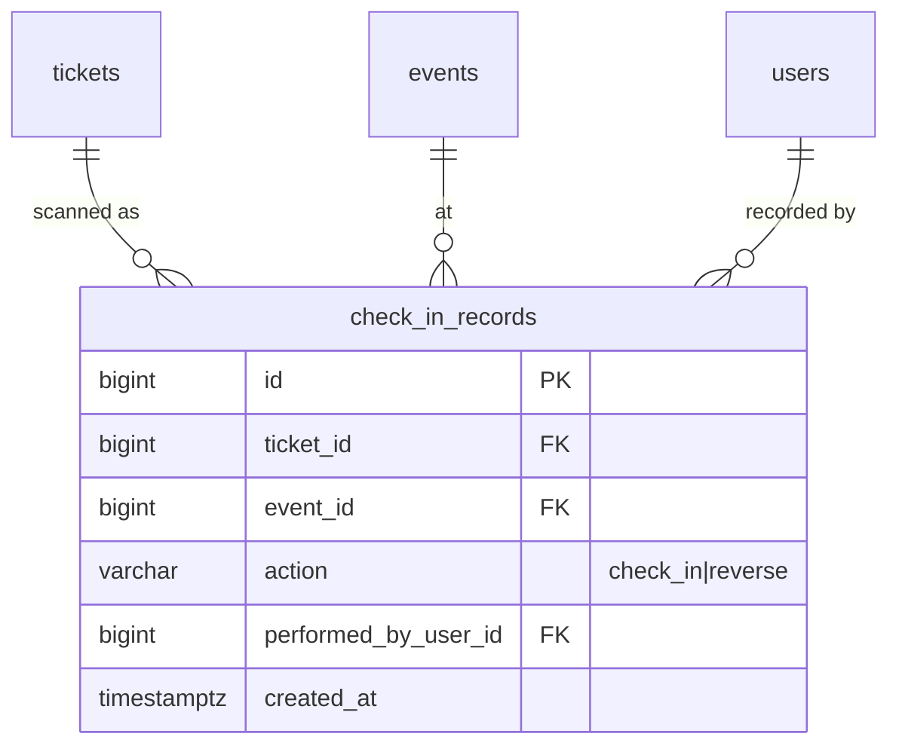

← [03 — Ordering](03-ordering.md) · [Index](README.md) · Next: [05 — Campaigns](05-campaigns.md)

# 04 — Check-In

**Tables:** `check_in_records`
**Depends on:** [03 — Ordering](03-ordering.md)
**SRS:** §4.8, §4.9, §4.16 · **Week:** 8

> Read [qr-codes.md](qr-codes.md) for the scan endpoint's verification order.

---

## What this slice is for

Recording who actually walked through the door, and making sure one ticket
admits one person.

One table, and it is deliberately boring. The interesting parts live elsewhere:
the *current* state is `tickets.status`, and the *safety* comes from the
conditional `UPDATE` in [concurrency.md](concurrency.md). This table is the
**history**.

---

## Diagram



---

## `check_in_records`

**Append-only.** Never updated, never deleted.

| Column | Type | Null | Notes |
|---|---|---|---|
| `id` | bigint PK | no | |
| `ticket_id` | bigint FK → `tickets` | no | |
| `event_id` | bigint FK → `events` | no | Scoping and §4.15 analytics |
| `action` | varchar | no | `check_in` \| `reverse` |
| `performed_by_user_id` | bigint FK → `users` | no | The Event Admin |
| `device_info` | varchar(200) | yes | Which device scanned it |
| `created_at` | timestamptz | no | |

```sql
CONSTRAINT ck_check_in_records_action
    CHECK (action IN ('check_in','reverse'))
```

Index: `(event_id, created_at DESC)` — powers the live check-in feed and §4.16's
timeline.

### A reversal is a new row, never a deletion

§4.8 requires the ability to "undo an accidental check-in where authorized."

The tempting implementation is to delete the check-in row, or flip a
`reversed` boolean. Both destroy information. **Append a second row with
`action = 'reverse'` instead.**

What you keep by doing this:

- Who reversed it, and when
- That it happened at all — a ticket checked in and reversed three times is a
  story worth being able to tell
- §4.16's requirement that the event timeline be trustworthy and that "audit
  entries shall not be editable or deletable"

The current state is always `tickets.status`. This table is why it got there.

### Why `event_id` when it's reachable through `ticket_id`

Same reason as `tickets.event_id` ([03](03-ordering.md#why-event_id-is-denormalized)):
§4.8 requires live counts of "registered and checked-in attendees" and §4.15
requires attendance analytics, both scoped to one event. One indexed lookup
beats a join chain, and a check-in record never moves between events.

### Should rejected scans be recorded?

§4.16 wants the timeline to include check-ins and reversals. It does not require
logging failed attempts.

**Recommendation:** log successful check-ins and reversals here; log rejected
scans to `audit_logs` ([07](07-platform.md)) if you want them at all. Mixing
"someone entered" with "someone waved a refunded ticket" in the same table makes
every attendance count a filtered query, and attendance counts are the thing
§4.15 asks for most.

---

## How it connects

```
tickets.status  ←── the current state (valid / checked_in / cancelled / refunded)
       │
       └── check_in_records  ←── the history of how it got there
```

The scan endpoint writes both, in one transaction:

```
1–4. Verify signature, typ, event, staff assignment   → see qr-codes.md
5.   UPDATE tickets SET status='checked_in'
      WHERE id = :id AND status = 'valid'
6.   rowcount = 1 → INSERT check_in_records (action='check_in')
     rowcount = 0 → read current status, return the specific reason, write nothing
```

Reversal is the mirror image:

```
UPDATE tickets SET status='valid' WHERE id = :id AND status = 'checked_in';
rowcount = 1 → INSERT check_in_records (action='reverse')
```

**Both are conditional `UPDATE`s.** The same ticket scanned at two doors at once
must produce exactly one check-in — see
[concurrency.md](concurrency.md#check-in-48).

### Who is allowed

§4.8: admins "view only assigned events." Authorization is a `staff_assignments`
lookup for `(event_id, user_id)` — see
[01 — permission matrix](01-identity.md#the-permission-matrix).

§4.8 says reversal happens "where authorized," which may be a narrower
permission than checking in. Decide with the team; if you keep them the same for
the MVP, say so explicitly rather than by omission.

---

## Counts the mobile app needs

§4.8 requires "the total number of registered and checked-in attendees."

```sql
-- registered
SELECT count(*) FROM tickets
 WHERE event_id = :id AND status IN ('valid','checked_in');

-- checked in
SELECT count(*) FROM tickets
 WHERE event_id = :id AND status = 'checked_in';
```

Both served by the `(event_id, status)` index on `tickets`. Note that
`cancelled` and `refunded` tickets are excluded from *registered* — they are not
people who are expected.

§4.15 additionally wants "absent ticket holders" (registered minus checked in)
and a check-in percentage. All three derive from these two numbers; **don't
store any of them.**

---

## For the frontend — the mobile app

This slice is almost entirely the React Native app (§9). §4.8 lists its
requirements; here is what each one implies.

**The five scan results** (§4.8) — colour *and* text, never colour alone:

| Result | Meaning at the door |
|---|---|
| **Valid** | Let them in. Just admitted |
| **Already used** | Someone already came in with this. Find out who |
| **Cancelled** | Order was cancelled. Not admitted |
| **Refunded** | They got their money back. Not admitted |
| **Invalid** | Bad signature, wrong event, or a campaign QR |

A boolean "ok / not ok" fails the requirement. The staff member's next action is
different in every one of these cases.

**Design for the actual environment.** A door is loud, dark or glaring, and
rushed. Large result text, high contrast, an unmistakable colour, and a sound or
haptic. The operator should not need to read a sentence to know whether to step
aside.

**Speed.** §7 wants validation within two seconds. Show a scanning state
immediately so the operator never wonders whether it registered.

**Manual search** (§4.8). Cameras fail — dead phone screens, cracked glass,
bright sun. Search by attendee name and by `public_code`, with check-in available
from the result. This is not optional; it is the fallback that keeps the door
moving.

**Undo** (§4.8). Reachable right after a scan — the accidental check-in is
noticed within seconds. Require a confirmation, because undo *also* moves the
counters.

**Live counts** (§4.8) visible without leaving the scanner. They are the
operator's sense of progress.

**Assigned events only** (§4.8). The event picker lists only events with a
`staff_assignments` row. **An empty list is a legitimate state** — a signed-in
admin with no assignments yet. Design that screen; don't let it look like an
error.

**Offline is out of scope.** §4.8 and §10 both defer it: venues are assumed to
provide internet. A dropped connection is an honest error, not a queue-and-sync
feature. Say so in the UI rather than silently accepting a scan you can't verify.

---

## Build checklist

- [ ] `app/models/check_in.py` — `check_in_records`
- [ ] Import it in `app/db/base.py`
- [ ] `alembic revision --autogenerate -m "check-in records"` — **read it**
- [ ] Scan endpoint following the [qr-codes.md](qr-codes.md) order exactly
- [ ] Returns **five distinct** outcomes, not a boolean
- [ ] Reversal endpoint, with its own permission check
- [ ] Counts endpoint for the mobile app
- [ ] Manual attendee search by name and `public_code`
- [ ] Tests:
  - [ ] **A campaign QR is rejected** (§11 success criterion)
  - [ ] Two concurrent scans of one ticket → exactly one check-in
  - [ ] A refunded ticket returns `refunded`, not a generic failure
  - [ ] An admin without an assignment for that event gets `403`
  - [ ] Reverse then re-check-in works, and leaves **three** rows in
        `check_in_records`
  - [ ] Counts exclude cancelled and refunded tickets

---

← [03 — Ordering](03-ordering.md) · [Index](README.md) · Next: [05 — Campaigns](05-campaigns.md)
