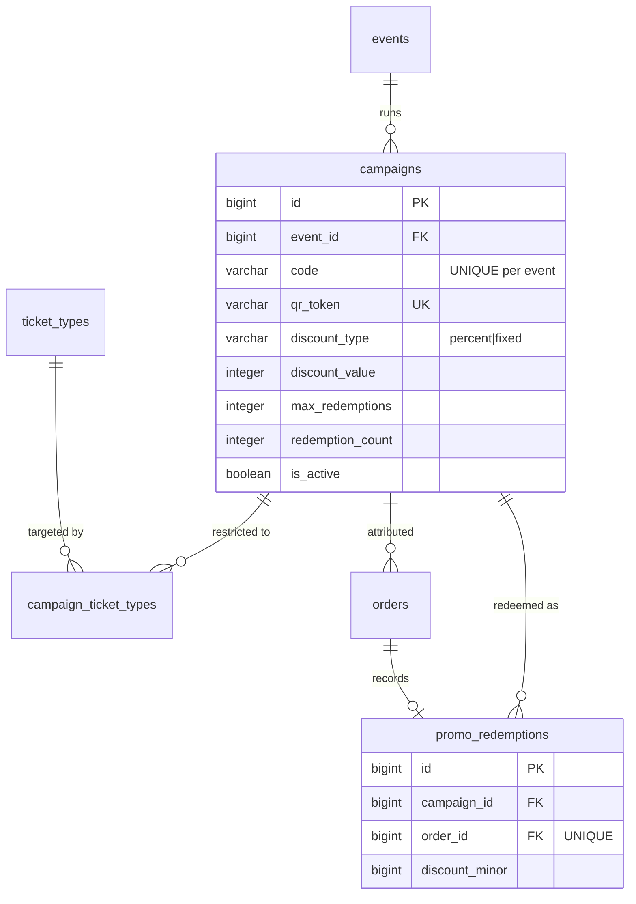

← [04 — Check-in](04-checkin.md) · [Index](README.md) · Next: [06 — Support](06-support.md)

# 05 — Promo Codes and Campaigns

**Tables:** `campaigns`, `campaign_ticket_types`, `promo_redemptions`
**Depends on:** [02 — Events](02-events.md), [03 — Ordering](03-ordering.md)
**SRS:** §4.14, §4.15, §7 · **Week:** 7

> Read [qr-codes.md](qr-codes.md#campaign-qr-codes) for the campaign QR link
> format and why it must never open a door.

---

## What this slice is for

Discounts, and knowing which marketing actually worked.

Two rules dominate the design, and both come straight from §4.14:

1. **The server calculates every discount.** The client sends a code, never an
   amount.
2. **A campaign QR is not a ticket.** §11 makes rejecting one at the door a
   success criterion for the project.

---

## A note on the entity list

§6 lists `Promotional Campaign` and `Promo Code` as two entities. **They are
collapsed into one table here.**

§4.14 describes it in the singular: "The system shall generate **a** unique promo
code and **a** special Campaign QR Code for the campaign." One code per campaign.
Two tables would be a one-to-one join for the entire life of the project.

Split them only if a campaign later needs several codes — for example
per-influencer codes sharing one budget. That's a plausible future, but §8 does
not ask for it and [YAGNI](README.md#working-rules) applies.

---

## Diagram



---

## `campaigns`

| Column | Type | Null | Notes |
|---|---|---|---|
| `id` | bigint PK | no | |
| `event_id` | bigint FK | no | §4.14 — campaigns belong to one event |
| `name` | varchar(200) | no | Internal label for the organizer |
| `code` | varchar(64) | no | What the attendee types. **UNIQUE (`event_id`, `code`)** |
| `qr_token` | varchar(64) | no | **UNIQUE.** Opaque token in the QR link |
| `discount_type` | varchar | no | `percent` \| `fixed` (§4.14) |
| `discount_value` | integer | no | Percent 0–100, **or** minor units |
| `starts_at` | timestamptz | yes | §4.14 validity dates |
| `ends_at` | timestamptz | yes | §4.14 |
| `max_redemptions` | integer | yes | `NULL` = unlimited (§4.14) |
| `redemption_count` | integer | no | default `0` |
| `is_active` | boolean | no | default `true`. §4.14 "disabled" |
| `created_at`, `updated_at` | timestamptz | no | |

```sql
CONSTRAINT ck_campaigns_discount_type
    CHECK (discount_type IN ('percent','fixed')),
CONSTRAINT ck_campaigns_percent_range
    CHECK (discount_type <> 'percent' OR discount_value BETWEEN 0 AND 100),
CONSTRAINT ck_campaigns_value_non_negative
    CHECK (discount_value >= 0),
CONSTRAINT ck_campaigns_within_redemption_limit
    CHECK (max_redemptions IS NULL OR redemption_count <= max_redemptions),
CONSTRAINT ck_campaigns_dates_ordered
    CHECK (ends_at IS NULL OR starts_at IS NULL OR ends_at > starts_at)
```

### `code` and `qr_token` are different things

| | `code` | `qr_token` |
|---|---|---|
| Who sees it | The attendee. Printed on posters, said aloud | Nobody — it's inside a URL |
| Shape | Short, memorable: `STUDENT20` | Long, random, opaque |
| Entered how | Typed into a checkout field | Scanned; the browser opens the link |

They coexist because §4.14 requires both routes: type the code, **or** scan the
QR and have it "automatically apply the associated promo code after server-side
validation."

`qr_token` is separate and unguessable so that campaign links can't be
enumerated — otherwise anyone could sweep for unpublished discounts.

### Why `code` is unique per event, not globally

Two different organizers should both be able to run `STUDENT20`. Global
uniqueness would mean the first organizer to use an obvious word takes it from
everyone.

The trade: **codes must always be applied in the context of an event.** Checkout
already knows the event, so this costs nothing — but it does mean there is no
"look up this code globally" endpoint, and the frontend must never assume one.

### `discount_value` means two things

`percent` → `discount_value` is 0–100.
`fixed` → `discount_value` is **minor units**, same as every other money field.

The `ck_campaigns_percent_range` constraint stops `discount_type='percent'` with
`discount_value = 5000`, which would otherwise be a 5000% discount — the platform
paying attendees to attend.

Two columns (`discount_percent`, `discount_amount_minor`) would avoid the
overloading but allow both to be set at once, which is a worse failure. One
column plus the constraint is the tighter design.

### `redemption_count` is a counter, and counters race

§7: "Promo-code validation and redemption limits shall be enforced **atomically**
on the server."

Exactly the overselling problem in a different costume, and it gets the same
solution:

```sql
UPDATE campaigns SET redemption_count = redemption_count + 1
 WHERE id = :id
   AND is_active
   AND (max_redemptions IS NULL OR redemption_count < max_redemptions)
   AND (starts_at IS NULL OR starts_at <= now())
   AND (ends_at   IS NULL OR ends_at   >  now());
-- rowcount = 0  =>  expired, disabled, or exhausted
```

Never `SELECT` the count, compare in Python, then `UPDATE`. Two attendees
redeeming the last use simultaneously would both succeed. See
[concurrency.md](concurrency.md#promo-redemption-limits-7).

`ck_campaigns_within_redemption_limit` is the backstop underneath it.

---

## `campaign_ticket_types`

§4.14: a campaign has "applicable ticket types."

| Column | Type | Notes |
|---|---|---|
| `campaign_id` | bigint FK | Composite PK |
| `ticket_type_id` | bigint FK | Composite PK |

**An empty set means the campaign applies to every ticket type on the event.**

That convention is worth stating explicitly because the alternative — inserting
a row for every ticket type on creation — silently breaks when the organizer adds
a *new* ticket type later. Should the existing campaign cover it? With the empty
set convention, "all" genuinely means all, including future ones.

Document this in the API too; the frontend needs to render "applies to: all
ticket types" from an empty array.

---

## `promo_redemptions`

One row per successful use.

| Column | Type | Null | Notes |
|---|---|---|---|
| `id` | bigint PK | no | |
| `campaign_id` | bigint FK | no | |
| `order_id` | bigint FK | no | **UNIQUE** — one redemption per order |
| `discount_minor` | bigint | no | What was **actually** granted |
| `created_at` | timestamptz | no | |

### `discount_minor` is a snapshot

Same reasoning as `order_items.unit_price_minor`
([03](03-ordering.md#unit_price_minor-is-a-deliberate-copy)): the organizer may
edit the campaign afterwards. If reporting recomputed the discount from
`campaigns.discount_value`, **every historical order's discount would change**
the moment someone edited the campaign.

Store what was granted, at the moment it was granted.

### Why `order_id` is UNIQUE

One promo code per order. §4.14 never describes stacking, and stacking is where
discount logic becomes genuinely hard — order of application, interaction with
percentage discounts, floor at zero.

The constraint makes the simple rule enforceable rather than merely intended.

### Why this table exists at all

`orders.campaign_id` already records attribution, so this looks redundant. It
isn't:

- `orders.campaign_id` answers *"where did this order come from?"* — including
  orders that arrived through a campaign link but where the discount didn't
  apply (wrong ticket type, campaign expired mid-checkout).
- `promo_redemptions` answers *"was the discount actually granted, and how
  much?"*

§4.14 requires reporting on both: "exact redemptions, orders, tickets sold, gross
revenue, discount amount, and net revenue for each campaign." Traffic and
conversion are different numbers.

---

## How they connect: applying a code

```
1. Attendee types a code, or arrives via ?c={qr_token}
2. Server looks it up:  WHERE event_id = :event AND code = :code
                        (or WHERE qr_token = :token)
3. Validate — all server-side (§4.14):
     - is_active
     - now() within starts_at / ends_at
     - redemption_count < max_redemptions
     - the selected ticket types intersect campaign_ticket_types
       (or that set is empty = applies to all)
4. Compute discount_minor from the order's items
5. Show the attendee the code, the discount, and the new total  ← §4.14 requires
   this BEFORE they complete checkout
6. On order confirmation, inside the same transaction:
     - atomic UPDATE on campaigns.redemption_count  → rowcount 0 aborts
     - INSERT promo_redemptions
     - set orders.campaign_id and orders.discount_minor
```

**Steps 3–4 run again at confirmation.** The code was validated when it was
applied, but minutes may have passed and the last redemption may be gone. §7
requires the atomic enforcement to be at the point of redemption, not at the
point of display.

---

## Reporting

§4.14 and §4.15 require per-campaign figures. All computed, none stored:

| Metric | Source |
|---|---|
| Redemptions | `count(promo_redemptions)` |
| Orders | `count(orders WHERE campaign_id = ...)` |
| Tickets sold | `count(tickets)` joined through those orders |
| Gross revenue | `sum(orders.subtotal_minor)` |
| Discount given | `sum(promo_redemptions.discount_minor)` |
| Net revenue | gross − discount − refunds |

§4.15: "Required analytics shall be calculated from authoritative BiletFlow
order, ticket, campaign, refund, and check-in records." **Nothing is stored
pre-aggregated.** If a query gets slow, add an index — a materialized total that
disagrees with the orders it summarizes is worse than a slow page.

### GA4 boundary

§4.14 allows GA4 to record campaign-link visits and checkout starts, but it
"may not receive attendee names, email addresses, phone numbers, ticket
identifiers, or other direct personal information."

So GA4 gets the campaign token and event slug. It never gets `public_code`,
`order_number`, or anything from `attendees`. §7 also requires that analytics
never block checkout — fire-and-forget, never awaited.

---

## For the frontend

**Applying a code**

- Send the code; **never send a discount amount.** The server computes it (§4.14).
- Display the applied code, the discount, and the updated total **before**
  checkout completes — §4.14 requires this explicitly.
- Rejections need specific messages (§4.14: "rejected with a clear message"):
  expired, disabled, fully redeemed, or not applicable to the chosen tickets.
  "Invalid code" for all four is a bad experience and fails the requirement.

**Arriving via a campaign QR**

The link is `/e/{slug}?c={qr_token}`. On load, apply it server-side and show it
as applied. The attendee scanned a poster — they should see the discount already
working, not a code field to fill in.

**Campaign QR codes must look different from ticket QR codes** (§4.14: "visually
and functionally distinct"). Different frame, colour, and an explicit label.
Two near-identical black squares with opposite meanings is a design bug.

**For organizers**

- Campaign builder: percent or fixed, dates, max redemptions, applicable ticket
  types. Empty ticket-type selection = "all", and the UI should say so.
- Percent inputs constrained to 0–100; fixed amounts in **major** units for
  display, converted to minor before sending.
- Downloadable campaign QR as a print-ready image — posters are the point.
- Live campaign performance from the metrics above.

**Money, again:** every `*_minor` field is an integer. Divide by 100 to display,
never use floats, and let the server do the arithmetic.

---

## Build checklist

- [ ] `app/models/campaign.py` — all three tables
- [ ] Import in `app/db/base.py`
- [ ] `alembic revision --autogenerate -m "campaigns"` — **read it**
- [ ] Verify the CHECK constraints landed, especially the percent range
- [ ] `qr_token` generator — opaque, unguessable, collision-safe
- [ ] Validation service, reusable at both apply-time and confirm-time
- [ ] Atomic redemption `UPDATE`, wired into order confirmation's transaction
- [ ] Campaign QR image generation with the `typ="cmp"` link
- [ ] Reporting queries
- [ ] Tests:
  - [ ] Two concurrent orders for the last redemption → exactly one succeeds
  - [ ] Expired, disabled, and exhausted codes each return their **own** message
  - [ ] A code restricted to ticket type A is rejected for ticket type B
  - [ ] Empty `campaign_ticket_types` applies to all types, including one added later
  - [ ] Editing a campaign's discount does **not** change past `promo_redemptions`
  - [ ] A client-sent discount amount is ignored
  - [ ] **A campaign QR is rejected by the admission endpoint** (§11)

---

← [04 — Check-in](04-checkin.md) · [Index](README.md) · Next: [06 — Support](06-support.md)
