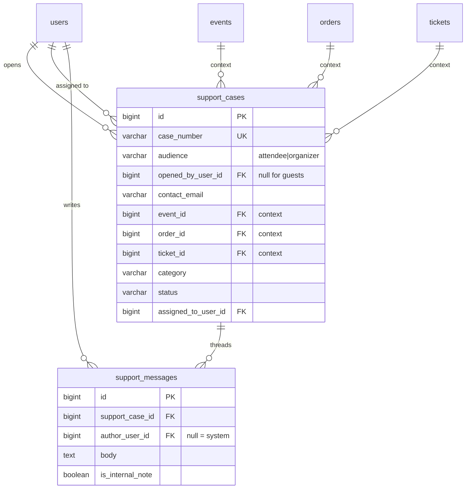

← [05 — Campaigns](05-campaigns.md) · [Index](README.md) · Next: [07 — Platform](07-platform.md)

# 06 — Support Cases

**Tables:** `support_cases`, `support_messages`
**Depends on:** [01 — Identity](01-identity.md), [02 — Events](02-events.md),
[03 — Ordering](03-ordering.md)
**SRS:** §4.13, §4.10, §7 · **Week:** 8

---

## What this slice is for

A contextual conversation about a specific problem — "my ticket never arrived,"
"I was charged twice" — between the person with the problem and whoever is
responsible for fixing it.

The design hinges on one thing: **who is allowed to read a case.** §7 requires
access to be "enforced by role and by relationship to the relevant event, order,
or ticket." Get that wrong and one attendee reads another's refund dispute.

---

## Two kinds of conversation

§4.13 describes two, with different participants:

| `audience` | Opened by | Answered by | About |
|---|---|---|---|
| `attendee` | An attendee | Organizer staff | A specific event, order, or ticket |
| `organizer` | An organizer | **Platform Admins** | Account, activation, payment, technical |

They are not the same conversation and must not mix. An organizer asking the
platform about their payout must never be visible to attendees, and an attendee's
complaint about an organizer goes to that organizer, not to the platform.

One table with an `audience` column, because the shape is identical and the
threading logic is identical. The column decides who may read and reply.

---

## Diagram



---

## `support_cases`

| Column | Type | Null | Notes |
|---|---|---|---|
| `id` | bigint PK | no | |
| `case_number` | varchar(32) | no | **UNIQUE.** Human-quotable |
| `audience` | varchar | no | `attendee` \| `organizer` |
| `opened_by_user_id` | bigint FK → `users` | **yes** | `NULL` for a guest |
| `contact_email` | varchar(320) | no | Always set — guests need a reply address |
| `event_id` | bigint FK | yes | §4.13 automatic context |
| `order_id` | bigint FK | yes | §4.13 automatic context |
| `ticket_id` | bigint FK | yes | §4.13 automatic context |
| `category` | varchar | no | Eight values — see below |
| `status` | varchar | no | Four values — see below |
| `assigned_to_user_id` | bigint FK → `users` | yes | §4.13 |
| `created_at`, `updated_at` | timestamptz | no | |
| `resolved_at` | timestamptz | yes | |

```sql
CONSTRAINT ck_support_cases_audience
    CHECK (audience IN ('attendee','organizer')),
CONSTRAINT ck_support_cases_category
    CHECK (category IN ('ticket_delivery','payment','refund','seating',
                        'event_info','check_in','account','technical')),
CONSTRAINT ck_support_cases_status
    CHECK (status IN ('open','in_progress','waiting_for_customer','resolved'))
```

Index: `(audience, status, updated_at DESC)` — the staff queue.
Index: `(event_id, status)` — an organizer's cases for one event.

### The category list is from the spec, verbatim

§4.13: "ticket delivery, payment, refund, seating, event information, check-in,
account, or technical problem." Eight values, exactly. Don't add a ninth without
updating the spec — §4.13 requires the requester to *select* one, so this list is
a UI dropdown as much as a database constraint.

### The status list is from the spec, verbatim

§4.13: "Open, In Progress, Waiting for Customer, and Resolved." Four values.
Transitions: [state-machines.md §8](../state-machines.md#8-support-case).

Note that **`resolved` is not terminal** — a reply reopens the case. That's what
"asynchronous" means in practice, and the UI must allow it.

### Three nullable context FKs

§4.13: "A support case shall automatically include the relevant user, event,
order, and ticket context when available."

They are separately nullable because context arrives at different depths. Opening
a case from an event page gives you `event_id` only. From a ticket, you get all
three. The word in the spec is *"when available."*

**This is not the polymorphic problem** from [07](07-platform.md#audit_logs).
There are exactly three known context types, they're all real foreign keys, and
they can coexist. Don't be tempted into `entity_type`/`entity_id` here — you'd
lose referential integrity for no benefit.

### `opened_by_user_id` is nullable

Because guests can buy tickets ([03](03-ordering.md#user_id-is-nullable--guests-can-buy)),
guests can have problems. A guest whose ticket never arrived is exactly the
person most likely to need support.

`contact_email` is therefore `NOT NULL` and is the reply address in both cases.
Access for a guest works the same way as guest order retrieval: a signed link.

---

## `support_messages`

| Column | Type | Null | Notes |
|---|---|---|---|
| `id` | bigint PK | no | |
| `support_case_id` | bigint FK | no | |
| `author_user_id` | bigint FK → `users` | yes | `NULL` = system message |
| `body` | text | no | |
| `is_internal_note` | boolean | no | default `false`. Staff-only |
| `created_at` | timestamptz | no | |

Index: `(support_case_id, created_at)` — the thread, in order.

### `is_internal_note`

A note staff leave for each other — "checked with the payment provider, refund is
in flight." **Never rendered to the requester.**

Not in §4.13, and it's the one addition here that isn't spec-driven. It is
included because the alternative is staff discussing cases somewhere the case
can't see, which defeats the purpose of having a case. It costs one boolean.

If you'd rather stay strictly minimal, drop it — but then say where staff notes
go instead.

**If you keep it:** the filter is a serialization concern, and it is the single
easiest place in this slice to leak. One serializer for staff, one for the
requester. Never one serializer with a flag.

### `author_user_id` nullable = system message

"This case was opened automatically because your payment failed." Status-change
notices too. Messages with no human author.

---

## Authorization

§7: "Support-case access shall be enforced by role and by relationship to the
relevant event, order, or ticket."

The check is two questions, and both must pass:

**1. What kind of case is it?**

| `audience` | Who may read and reply |
|---|---|
| `attendee` | The requester, **and** staff of the related event |
| `organizer` | The requesting organizer, **and** Platform Admins |

**2. What is this user's relationship to the context?**

For an attendee case, "staff of the related event" means the event's owning
organizer, resolved through `event_id → events.organizer_profile_id`. Not "any
organizer." Not "anyone with an organizer profile."

This reuses [01's permission matrix](01-identity.md#the-permission-matrix)
exactly — the same relationship walk, applied to a different resource.

**Never** filter cases in Python after fetching them. The query itself must be
scoped, or the first `N+1` fix someone writes will remove the filter.

§4.13: "The system shall retain the case history and prevent users from viewing
cases they are not authorized to access."

---

## How they connect

```
An attendee opens a case from a ticket page
  └─ support_cases: audience='attendee'
                    event_id, order_id, ticket_id all populated
                    category chosen by the requester
                    status='open'
  └─ support_messages: their first message
  └─ notifications: to the event's organizer

Organizer replies
  └─ support_messages
  └─ status → 'in_progress'
  └─ notifications: to contact_email

...back and forth...

Organizer resolves
  └─ status → 'resolved', resolved_at set
  └─ notifications

Attendee replies a week later
  └─ status → 'in_progress'   ← resolved is not terminal
```

Every message and every status change fires a notification (§4.10: "new support
message, support-case assignment, and support-case status changes"). See
[07](07-platform.md#notifications).

---

## Explicitly out of scope

§4.13 is unusually clear about what the MVP does **not** need:

> "The academic MVP does not require typing indicators, presence information,
> voice messages, AI chatbots, or real-time WebSocket delivery."

§9 confirms: "REST API with periodic refresh or lightweight polling; real-time
sockets are optional and not required."

**Do not build WebSockets for this.** Polling a REST endpoint is the specified
solution, it is dramatically less work, and §13.4 says feature development stops
after week 9. Attachments are also deferred pending
[open question #5](README.md#open-questions).

---

## For the frontend

**Opening a case**

- Entry points from event, order, and ticket pages (§4.13). Context is filled in
  from the page — **never ask the user which order they mean** when you already
  know.
- Category is a required dropdown with the eight §4.13 values.
- Show the attached context so the requester can confirm it's the right ticket.

**The thread**

- Chronological, clearly attributed, with timestamps.
- Poll for new messages (§9). Somewhere around 10–15 seconds while the thread is
  open; stop when the tab is hidden.
- **Internal notes are never rendered to the requester.** If your client ever
  receives one, that's a backend bug worth reporting loudly.
- System messages need distinct styling — they have no author.

**Status**

Four values, and they mean different things to the two sides:

| Status | Requester sees | Staff sees |
|---|---|---|
| `open` | "Submitted, awaiting a reply" | **Unclaimed — needs attention** |
| `in_progress` | "Someone is looking at this" | Being handled |
| `waiting_for_customer` | **"We need something from you"** | Blocked on them |
| `resolved` | "Resolved" + a way to reply again | Closed, may reopen |

`waiting_for_customer` is the one that needs to be loud on the requester's side —
the case is stalled and it's their move.

**Guests**

A guest case has no session. Access is via a signed link in email; the thread
view must work without a login. Don't build this flow assuming an authenticated
user.

**Staff queue**

Sort by `updated_at`. Filter by status, category, and event. `open` cases are the
ones nobody has picked up — surface them first.

---

## Build checklist

- [ ] `app/models/support.py` — both tables
- [ ] Import in `app/db/base.py`
- [ ] `alembic revision --autogenerate -m "support cases"` — **read it**
- [ ] `case_number` generator
- [ ] **Scoped queries** — authorization in the `WHERE` clause, not in Python
- [ ] Two serializers: staff (with internal notes) and requester (without)
- [ ] Signed-link access for guests
- [ ] Notifications on new message, assignment, and status change (§4.10)
- [ ] Tests:
  - [ ] Attendee A cannot read attendee B's case
  - [ ] An unrelated organizer cannot read a case for someone else's event
  - [ ] An attendee never receives `is_internal_note` messages
  - [ ] `resolved` → reply → `in_progress` works
  - [ ] A guest can open and read a case with no account
  - [ ] Context FKs are populated from the page the case was opened on

---

← [05 — Campaigns](05-campaigns.md) · [Index](README.md) · Next: [07 — Platform](07-platform.md)
