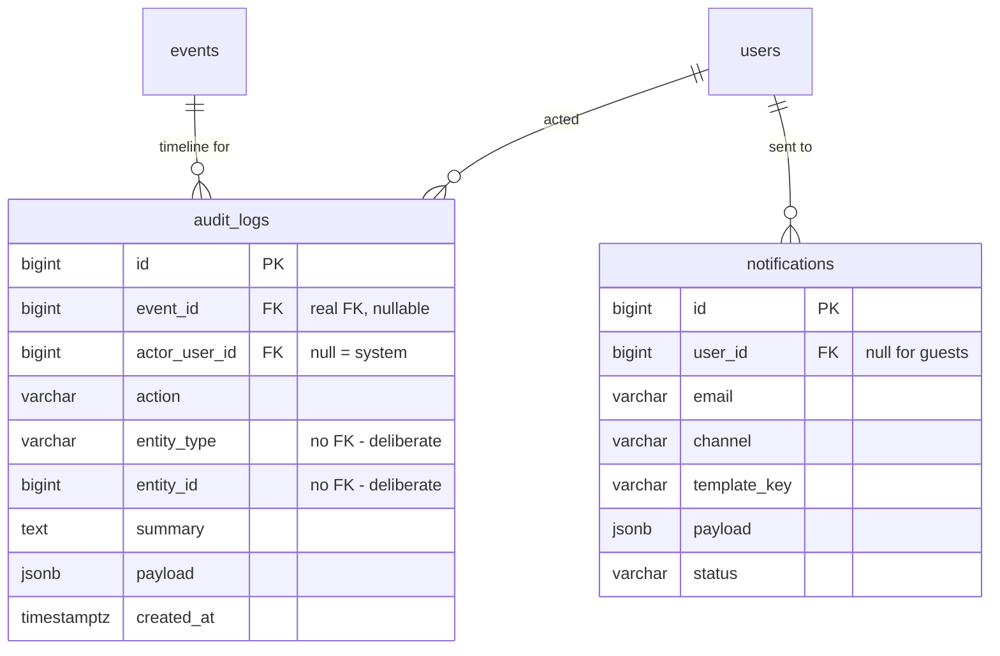

← [06 — Support](06-support.md) · [Index](README.md) · Next: [08 — Seating (bonus)](08-seating-bonus.md)

# 07 — Audit and Notifications

**Tables:** `audit_logs`, `notifications`
**Depends on:** everything — these record what the other slices do
**SRS:** §4.16, §4.10, §4.9, §4.12 · **Week:** 9

---

## What this slice is for

Two cross-cutting concerns that every other slice writes into:

- **`audit_logs`** — what happened, who did it. §4.16's event activity timeline.
- **`notifications`** — what we told people about it. §4.10's nine triggers.

Both are written by other slices, so the work here is mostly *adding calls in
places you already built* rather than new endpoints.

---

## Diagram



---

## `audit_logs`

§4.16 requires each history entry to contain "a timestamp, acting user, action
type, affected entity, and short description," filterable by date range and
activity type.

| Column | Type | Null | Notes |
|---|---|---|---|
| `id` | bigint PK | no | |
| `event_id` | bigint FK → `events` | **yes** | **A real FK.** `NULL` for account-level actions |
| `actor_user_id` | bigint FK → `users` | yes | `NULL` = system action |
| `action` | varchar(64) | no | `event.published`, `ticket.checked_in`, … |
| `entity_type` | varchar(32) | no | `ticket`, `order`, `campaign`, … |
| `entity_id` | bigint | no | **No FK — deliberate.** See below |
| `summary` | text | no | §4.16 "short description" |
| `payload` | jsonb | yes | Before/after detail |
| `created_at` | timestamptz | no | |

Index: `(event_id, created_at DESC)` — every §4.16 query.
Index: `(event_id, action)` — §4.16's "filter by activity type."

### The polymorphic problem, and why this shape

"Affected entity" spans roughly ten tables — tickets, orders, refunds,
campaigns, ticket types, support cases, staff assignments, events themselves.
**A real foreign key cannot point at ten tables.**

Three known solutions, all with costs:

| Option | Cost |
|---|---|
| One nullable FK per entity type | Full integrity, but a new column every time an entity becomes auditable. Ten mostly-`NULL` columns |
| `entity_type` + `entity_id`, no FK | One stable shape forever, but the database can't stop `entity_id` pointing at a deleted row |
| One audit table per entity type | Integrity and simplicity, but every timeline query becomes a `UNION` across ten tables |

**The chosen shape is a hybrid**, and the split is deliberate:

- `event_id` stays a **real foreign key**, because that's what every §4.16 query
  filters on. The timeline is always "this event's history," so the column that
  actually needs integrity keeps it.
- `entity_type`/`entity_id` gives up integrity **only** for the pointer to the
  specific affected thing, which is used for display and linking rather than
  joining.

Integrity is preserved where queries depend on it, and traded only where they
don't.

### Append-only

§4.16: "Audit entries shall not be editable or deletable through normal
organizer interfaces."

Practically:

- No `UPDATE` or `DELETE` path in the service layer. Not "we won't call it" — no
  method exists.
- No `updated_at` column. Its absence documents the intent.
- If you want belt-and-braces, `REVOKE UPDATE, DELETE ON audit_logs` from the
  application role. Consider it for the defence; it's a strong demonstration that
  the constraint is real rather than conventional.

A correction is a **new row**, exactly like a check-in reversal
([04](04-checkin.md#a-reversal-is-a-new-row-never-a-deletion)).

### `action` naming

Use `noun.verb_past`, consistently:

```
event.published        event.cancelled        event.suspended
ticket_type.price_changed                     ticket_type.capacity_changed
order.confirmed        order.refunded
ticket.checked_in      ticket.check_in_reversed
campaign.created       campaign.disabled
support_case.status_changed
staff.assigned
```

§4.16 names most of these directly: "event publication or cancellation, ticket
price or capacity changes, refunds, promo-code creation or disabling,
support-case status changes, check-ins, and check-in reversals."

Consistency matters because `action` is a filter facet in the UI. A mix of
`event.published` and `PUBLISHED_EVENT` makes the filter list unusable.

### `payload` and what not to put in it

`jsonb` for before/after values on a price change, the reason for a suspension,
the amount of a refund.

**Do not put personal data in here.** Names, emails, and phone numbers belong in
`attendees`, where they can be found and handled. Once they're smeared through
an append-only audit log they cannot be corrected or removed, and the log is a
table nobody thinks to check.

### What writes here

Every slice:

| Slice | Actions |
|---|---|
| [01](01-identity.md) | `staff.assigned`, `user.suspended` |
| [02](02-events.md) | `event.published/cancelled/suspended`, `ticket_type.price_changed` |
| [03](03-ordering.md) | `order.confirmed/cancelled/refunded`, `refund.initiated` (§4.9 requires this one) |
| [04](04-checkin.md) | `ticket.checked_in`, `ticket.check_in_reversed` |
| [05](05-campaigns.md) | `campaign.created/disabled` |
| [06](06-support.md) | `support_case.status_changed`, `support_case.assigned` |

§4.9 makes it explicit for money: "All payment and refund actions shall be
recorded in an audit log."

### Authorization

§4.16: "Organizer staff shall only see history for events they are authorized to
manage; Platform Admins may view history for moderation or support purposes."

And §7: audit data is "protected by the same event-level authorization rules as
the underlying operational records." So the same relationship walk from
[01](01-identity.md#the-permission-matrix), keyed on `event_id`.

---

## `notifications`

§4.10 lists nine triggers. This table is the outbox.

| Column | Type | Null | Notes |
|---|---|---|---|
| `id` | bigint PK | no | |
| `user_id` | bigint FK → `users` | yes | `NULL` for guests |
| `email` | varchar(320) | no | Always set — guests have no user row |
| `channel` | varchar | no | `email` \| `in_app` |
| `template_key` | varchar(64) | no | `order.confirmed`, `event.cancelled`, … |
| `payload` | jsonb | no | Template variables |
| `status` | varchar | no | `pending` \| `sent` \| `failed` |
| `sent_at` | timestamptz | yes | |
| `created_at` | timestamptz | no | |

Index: `(status, created_at)` — the sender picks up `pending` rows.

### Why rendered content is not stored

Only `template_key` and `payload`. So a typo fixed in a template corrects every
future send without a data migration, and the table doesn't grow by the length
of every email body.

The trade: you cannot reproduce the exact bytes of an email sent last month if
the template changed. For this project that's the right trade — nothing here is
a legal record.

### Why a table instead of sending inline

Sending email inside the request that confirms an order means:

- The order confirmation is slow, because SMTP is slow.
- If email fails, does the order fail? Both answers are bad.

A row is written in the confirming transaction; a worker sends it. The order
succeeds or fails on its own merits, and a failed send is a retryable row rather
than a lost notification.

§7 makes the same argument for analytics — nothing may "block or delay ticket
selection, checkout, payment confirmation, or ticket issuance."

### The nine triggers

§4.10, all of them:

| `template_key` | Fired by |
|---|---|
| `account.verify_email` | [01](01-identity.md) |
| `order.confirmed` | [03](03-ordering.md) |
| `payment.failed` | [03](03-ordering.md) |
| `ticket.delivered` | [03](03-ordering.md) |
| `event.updated` | [02](02-events.md) |
| `event.cancelled` | [02](02-events.md) |
| `refund.completed` | [03](03-ordering.md) |
| `payout.status_changed` | [01](01-identity.md) |
| `support.new_message`, `support.assigned`, `support.status_changed` | [06](06-support.md) |

### Guests

`user_id` is nullable and `email` is not, for the same reason as everywhere else:
guests buy tickets ([03](03-ordering.md#user_id-is-nullable--guests-can-buy)) and
must receive them. The `email` column is the address in both cases, so the sender
never branches on whether a user row exists.

### Locale

`users.locale` ([01](01-identity.md)) picks the template language — §7 requires
Kazakh and Russian with English additional. For guests there is no `locale`;
carry it in `payload` from the request that created the notification, or fall
back to the event's default.

---

## For the frontend

**Audit / activity timeline** (§4.16)

- Chronological, filterable by **date range** and **activity type** — both
  required by §4.16.
- `action` values are stable keys; map them to human sentences in the client so
  the labels can be translated (§7 requires kk/ru/en).
- `entity_type` + `entity_id` let you link to the affected thing. **`entity_id`
  has no FK**, so the target may be gone — every such link needs a graceful
  "no longer available" state.
- The timeline is **read-only**. There is no edit or delete affordance, by
  design; don't build one.
- Empty timelines are normal for a fresh event. Design the empty state.

**In-app notifications**

- `channel = 'in_app'` rows are the notification feed.
- Poll, consistent with §9's guidance for support. No WebSockets.
- `template_key` + `payload` means the **client renders the text**. That's what
  makes localisation possible — but it also means an unknown `template_key` must
  degrade gracefully rather than render blank.

**What not to build**

- No UI for editing audit entries.
- No "delete notification" that hard-deletes; mark it read client-side.
- Don't show `payload` raw. It's structured data for rendering, not user-facing
  text.

---

## Build checklist

- [ ] `app/models/audit.py` — `audit_logs`
- [ ] `app/models/notification.py` — `notifications`
- [ ] Import both in `app/db/base.py`
- [ ] `alembic revision --autogenerate -m "audit and notifications"` — **read it**
- [ ] An audit helper the transition methods call — one function, one shape
- [ ] Wire it into **every** transition in
      [state-machines.md](../state-machines.md); §4.9 makes money actions mandatory
- [ ] Notification enqueue helper + a worker that drains `pending`
- [ ] Email templates for all nine §4.10 triggers, in the supported locales
- [ ] Timeline endpoint with date-range and action filters, **event-scoped
      authorization in the query**
- [ ] Tests:
  - [ ] Each transition writes exactly one audit row with the right `action`
  - [ ] An organizer cannot read another organizer's event timeline
  - [ ] The service layer exposes no update or delete for `audit_logs`
  - [ ] A failed send leaves `status='failed'` and does **not** roll back the order
  - [ ] Guest notifications work with `user_id IS NULL`
  - [ ] Audit `payload` contains no attendee names or emails

---

← [06 — Support](06-support.md) · [Index](README.md) · Next: [08 — Seating (bonus)](08-seating-bonus.md)
