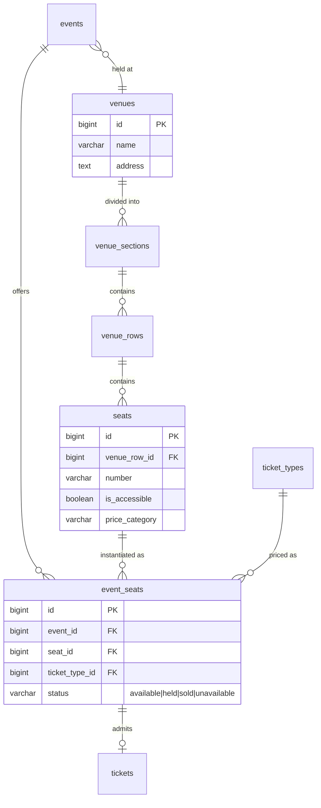

← [07 — Platform](07-platform.md) · [Index](README.md)

# 08 — Assigned Seating *(bonus)*

**Tables:** `venues`, `venue_sections`, `venue_rows`, `seats`, `event_seats`
**Depends on:** [02 — Events](02-events.md), [03 — Ordering](03-ordering.md)
**SRS:** §4.3.1, §7 · **Week:** cut first

---

> ## ⚠ Do not build this yet
>
> **The SRS contradicts itself about whether this is required.**
>
> - **§4.3.1** states it in "shall" language across ten bullets — the language of
>   a requirement.
> - **§8** lists it under *Bonus and Stretch Features*.
> - **§13.4** says: "If the project falls behind, remove **assigned seating**,
>   calendar export, advanced analytics, localization polish, and refund
>   simulation before cutting the core ticketing flow."
>
> Five of the SRS's 24 core entities live here. **This needs a ruling from
> whoever owns the document** before anyone writes a model.
> ([Open question #1](README.md#open-questions).)

---

## Why this file exists anyway

Three columns already reference these tables:

- `holds.event_seat_id`
- `order_items.event_seat_id`
- `tickets.event_seat_id`

They are nullable and stay `NULL` for the entire term. They exist so that adding
seating later is an **additive migration** — `CREATE TABLE` plus populating a
column — rather than a rewrite of `orders` and `tickets`, which by week 9 will
contain demonstration data.

That decision was made deliberately: design for seating, build general admission.
This file is what makes those `NULL` columns mean something specific rather than
being three mystery columns nobody dares remove.

---

## Diagram



---

## The physical venue — `venues`, `venue_sections`, `venue_rows`, `seats`

These describe **chairs that exist in a building**. They are created once per
venue and reused by every event held there.

### `venues`

| Column | Type | Notes |
|---|---|---|
| `id` | bigint PK | |
| `name` | varchar(300) | |
| `address` | text | |
| `created_at` | timestamptz | |

### `venue_sections`

| Column | Type | Notes |
|---|---|---|
| `id` | bigint PK | |
| `venue_id` | bigint FK | |
| `name` | varchar(100) | "Orchestra", "Balcony" |
| `display_order` | integer | |

### `venue_rows`

| Column | Type | Notes |
|---|---|---|
| `id` | bigint PK | |
| `venue_section_id` | bigint FK | |
| `name` | varchar(20) | "A", "12" — a string, not an integer |
| `display_order` | integer | |

**The table is `venue_rows`, not `rows`.** `row` is a reserved word in Postgres;
`rows` avoids double-quoting the identifier in every raw query forever. Same
reason `users` and `orders` are plural
([conventions](README.md#reserved-words)).

`name` is a **string** because real venues label rows "A", "AA", "12", and
sometimes skip letters. An integer forces a lie.

### `seats`

| Column | Type | Notes |
|---|---|---|
| `id` | bigint PK | |
| `venue_row_id` | bigint FK | |
| `number` | varchar(10) | Also a string |
| `is_accessible` | boolean | §4.3.1 accessible seats |
| `price_category` | varchar(50) | §4.3.1 price categories |
| | **UNIQUE (`venue_row_id`, `number`)** | Two seat 5s in row A is a data error |

`price_category` is a **label**, not a price — "Premium", "Standard". The actual
price comes from the `ticket_types` row that `event_seats` points at, because the
same physical seat costs different amounts at different events.

---

## The sellable inventory — `event_seats`

This is the table that actually matters.

| Column | Type | Notes |
|---|---|---|
| `id` | bigint PK | |
| `event_id` | bigint FK | |
| `seat_id` | bigint FK | |
| `ticket_type_id` | bigint FK | What this seat costs **at this event** |
| `status` | varchar | `available` \| `held` \| `sold` \| `unavailable` |
| `created_at`, `updated_at` | timestamptz | |

```sql
CONSTRAINT uq_event_seats_event_id_seat_id UNIQUE (event_id, seat_id),
CONSTRAINT ck_event_seats_status
    CHECK (status IN ('available','held','sold','unavailable'))
```

### Why this table exists

One venue hosts many events. **A seat's availability is a property of the event,
not of the chair.** Row A Seat 5 can be sold tonight and free tomorrow.

Putting `status` on `seats` would mean one event's sales corrupting every other
event in the same building.

`ticket_type_id` lives here for the same reason: the same seat is ₸5,000 at a
student night and ₸20,000 at a gala.

### The UNIQUE constraint is the whole concurrency story

```sql
UNIQUE (event_id, seat_id)
```

§4.3.1: "The system shall prevent two orders from purchasing the same seat,
**including when multiple attendees check out concurrently**."

That sentence reduces to this one constraint. Unlike general admission — which
needs a counter and an atomic conditional `UPDATE`
([concurrency.md](concurrency.md)) — a seat is a **row**, and claiming it twice
is *physically impossible* once the constraint exists.

This is the strongest guarantee available, and it's also why materialising rows
is right here and wrong for GA: 10,000 GA units would be 10,000 rows before a
single sale, but a seated venue's seats are a fixed, modest, real-world number.

### `unavailable` is not `sold`

Broken chair, obstructed view, held back for the organizer, unsold-by-choice.
Distinguishing it from `sold` matters for §4.15's capacity analytics — an
unavailable seat was never sellable and shouldn't count against a sell-through
rate.

---

## How it plugs into what already exists

**No table in [03](03-ordering.md) changes.** That is the entire payoff of this
design.

| Existing column | Currently | With seating |
|---|---|---|
| `holds.event_seat_id` | `NULL` | The held seat |
| `order_items.event_seat_id` | `NULL` | The purchased seat |
| `tickets.event_seat_id` | `NULL` | The seat on the ticket |
| `events.venue_id` | `NULL` | The venue |
| `events.seating_mode` | `general_admission` | `assigned` |

The existing constraints already anticipate it:

```sql
-- holds
CHECK (event_seat_id IS NULL OR quantity = 1)
-- order_items
CHECK (event_seat_id IS NULL OR quantity = 1)
```

A seat hold is always one unit. Those constraints were written in week 5 for a
feature built in week 9.

§4.3.1: "The assigned section, row, and seat number shall be stored on the ticket
and order item." Both get the FK; section and row are reachable through
`seat → venue_row → venue_section`.

### Seat selection flow

```
1. Attendee opens the seat map
     └─ SELECT event_seats JOIN seats JOIN venue_rows JOIN venue_sections
        WHERE event_id = :id
2. Attendee picks a seat
     └─ INSERT holds (event_seat_id, quantity=1, expires_at)
        UPDATE event_seats SET status='held' WHERE id=:id AND status='available'
        rowcount 0 → someone got there first, refresh the map
3. Checkout as normal — orders, order_items, attendees
4. Confirmation
     └─ event_seats.status → 'sold'
     └─ tickets.event_seat_id set
5. Abandoned
     └─ sweeper: holds released, event_seats.status → 'available'
```

Step 2 is the **same conditional-`UPDATE` pattern** as everything else
([concurrency.md](concurrency.md)) — with the `UNIQUE` constraint underneath as
the backstop.

---

## For the frontend

§4.3.1 and §7 have unusually specific UI requirements here.

**Six seat states, distinguished by colour AND text/symbol:**

| State | Meaning |
|---|---|
| Available | Selectable |
| Selected | This attendee has picked it, not yet held |
| Temporarily held | Someone else is checking out — **not permanently gone** |
| Sold | Taken |
| Unavailable | Not for sale at all |
| Accessible | §4.3.1 — an accessible seat, orthogonal to the above |

§4.3.1: states must be distinguished "with **both colors and text or symbols**."
Colour alone fails the requirement and fails colour-blind users. §7 additionally
requires "accessible labels in addition to color indicators."

This is an **accessibility requirement, not a styling preference.** Each seat
needs a text label a screen reader can announce: "Section A, Row 12, Seat 7,
₸5,000, available, accessible seat."

**Rendering** (§9: "React with SVG or Canvas rendering")

- SVG is the better choice: DOM nodes are individually focusable and labellable,
  which Canvas is not. For one predefined layout the node count is manageable.
- §7: usable on desktop **and mobile**. Pinch-zoom and pan on small screens.
- Keyboard navigation between seats, not mouse-only.

**Held seats expire**

A seat shown as "temporarily held" may become available in minutes. Refresh
periodically, and don't present it as permanently gone.

**Price before checkout.** §4.3.1: attendees "shall be able to select one or more
available seats and **see the ticket price before continuing to checkout**."
The price comes from the `ticket_types` row via `event_seats.ticket_type_id`.

**The countdown.** Once seats are held, the same visible timer as
[03](03-ordering.md#for-the-frontend). Losing a chosen seat with no warning is
the worst experience in the whole flow.

---

## Scope discipline

§13.4 could not be clearer: if the project falls behind, **this goes first**.

The MVP success criteria in §11 do not mention seating at all. A polished general
admission flow beats a half-finished seat map, and §13.4 says "bonus features
shall not be started at the expense of an incomplete required flow."

If it does get built, note that §8 scopes it to **"one predefined
assigned-seating layout"** — seeded fixture data, not a venue editor. §8 also
explicitly excludes a "visual venue-layout designer and arbitrary venue imports."
Do not build an editor.

---

## Build checklist *(only after the §4.3.1 contradiction is resolved)*

- [ ] Get the ruling. Do not start without it
- [ ] `app/models/venue.py` — the four physical tables
- [ ] `app/models/event_seat.py` — `event_seats`
- [ ] Import in `app/db/base.py`
- [ ] `alembic revision --autogenerate -m "assigned seating"` — **read it**
- [ ] Confirm the `UNIQUE (event_id, seat_id)` constraint reached the migration.
      Without it, this whole slice is unsafe
- [ ] Seed the one predefined layout (§8) as a fixture, not an editor
- [ ] Populate `event_seats` when an event is set to `seating_mode='assigned'`
- [ ] Extend hold creation to the seat path
- [ ] Extend the sweeper to reset `event_seats.status`
- [ ] Tests:
  - [ ] Two concurrent attendees pick the same seat → exactly one wins
  - [ ] The `UNIQUE` constraint refuses a hand-written duplicate
  - [ ] An expired seat hold returns the seat to `available`
  - [ ] `unavailable` seats are excluded from sell-through analytics
  - [ ] Section, row, and seat resolve correctly onto the ticket and PDF

---

← [07 — Platform](07-platform.md) · [Index](README.md)
