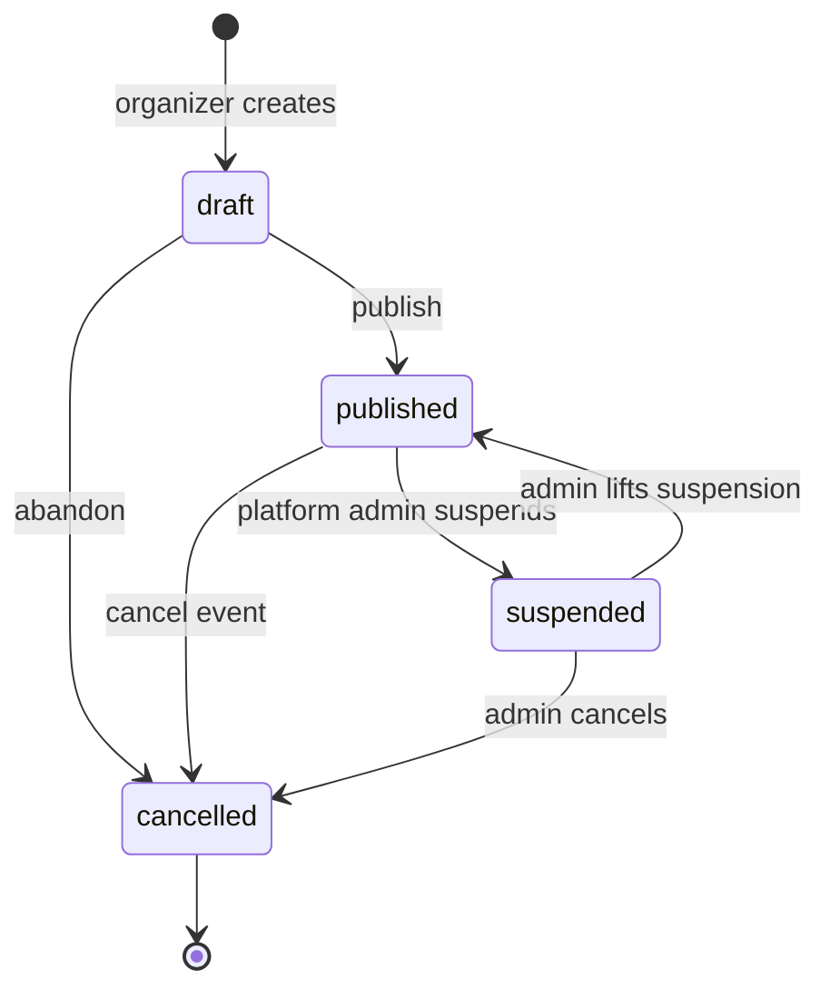
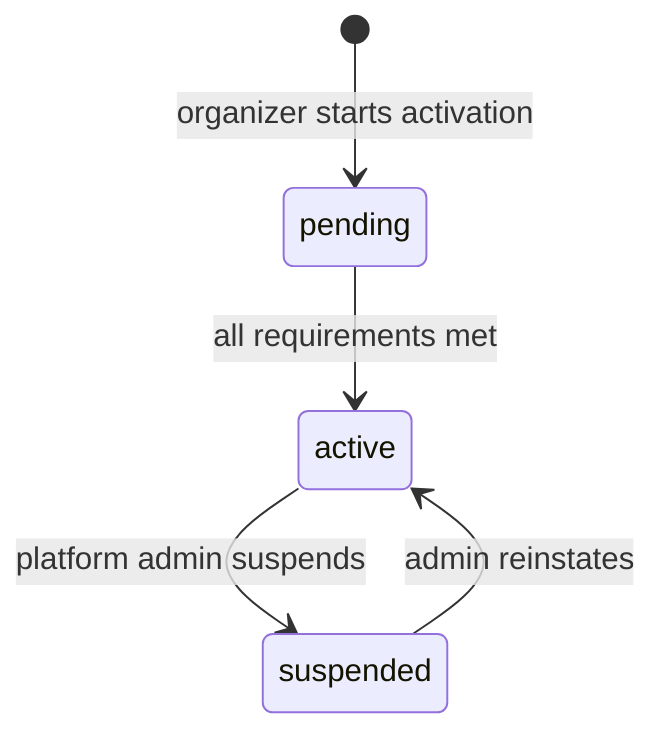
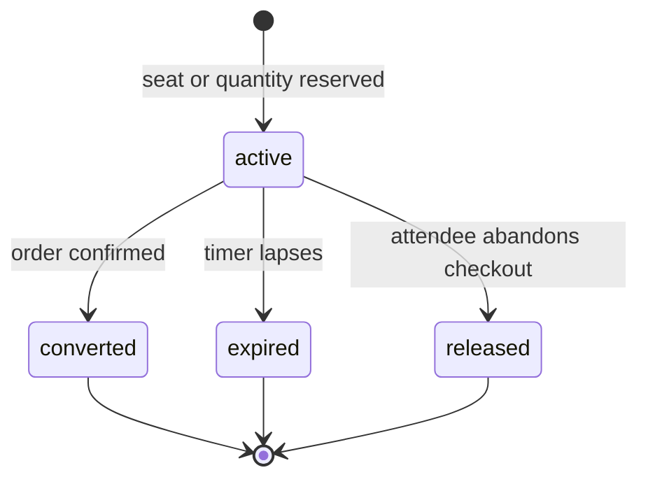
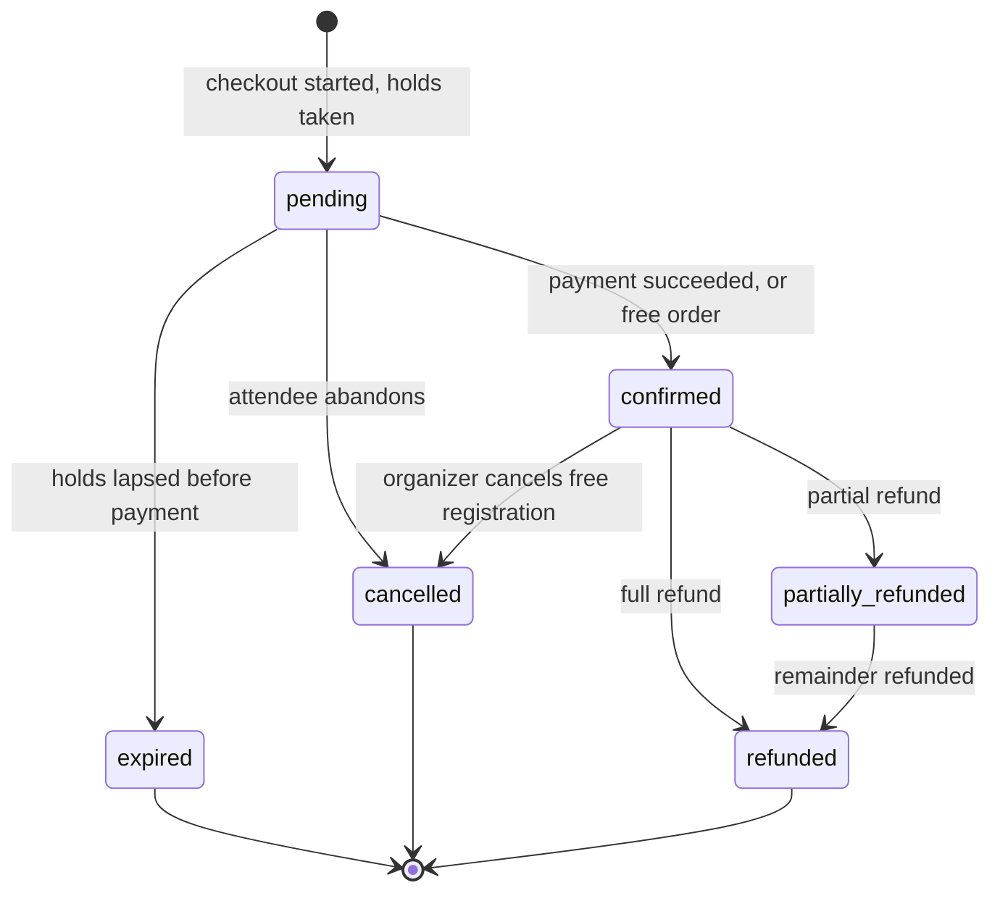
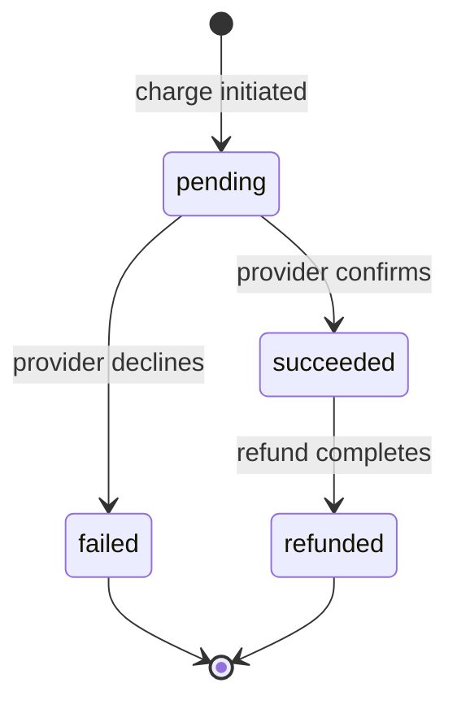
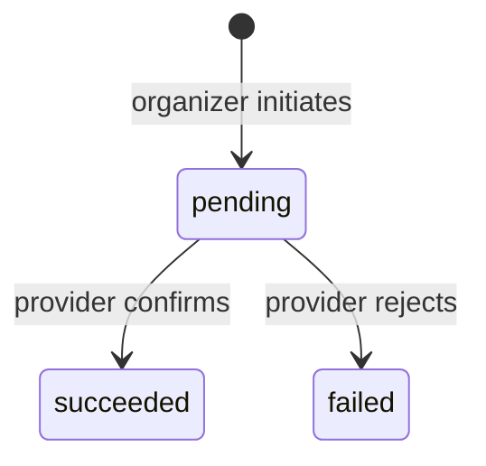
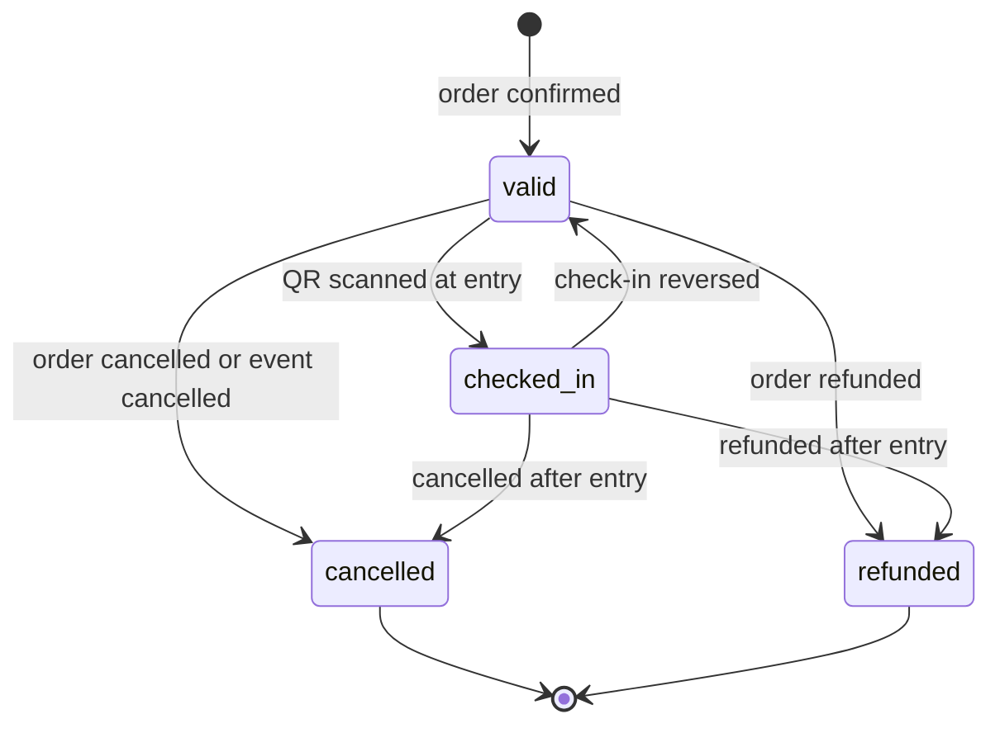
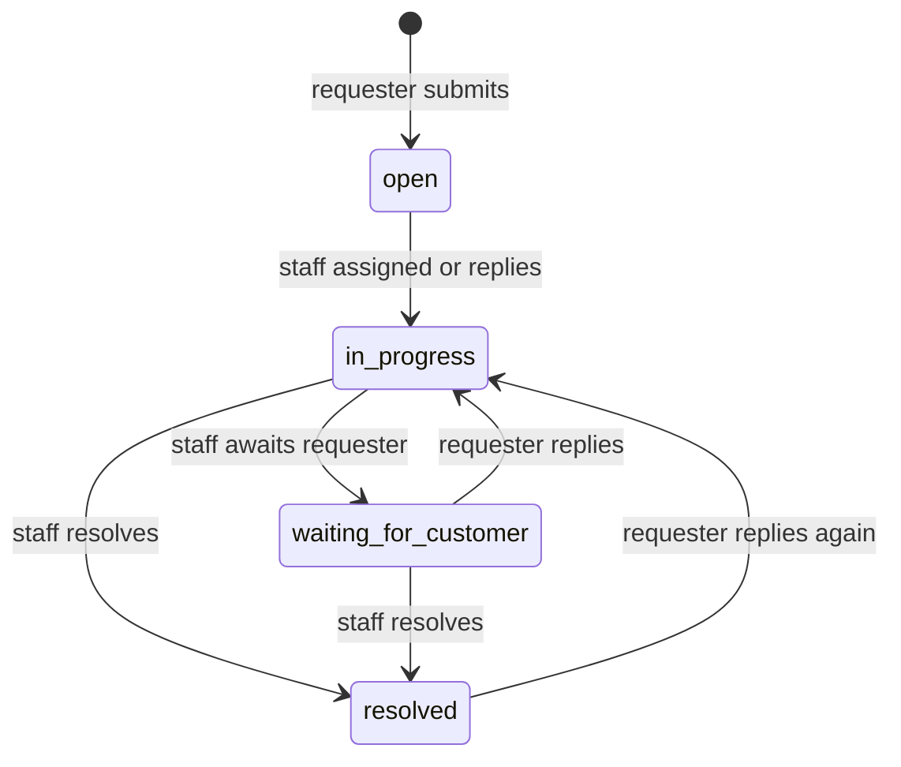

# BiletFlow — State Machines

Companion to the [data model](data-model/README.md). Section references point at
`BiletFlow_SRS_Initial_Draft.pdf` v0.3.

Every `status` column in the schema is listed here with its legal transitions.
If a transition is not in these tables, it is a bug.

---

## 0. Implementation rules

These apply to every machine below.

**1. One entry point per entity.** All status changes go through a single
service method — `orders.transition(order, to, *, actor, reason)` — never a bare
`order.status = "confirmed"` somewhere in a route handler. The method checks
legality, writes the audit row, and fires notifications. A direct assignment
skips all three, and it will be written by whoever is in a hurry in week 10.

**2. Illegal transitions raise, they do not silently no-op.** A refund attempt on
an already-refunded order is a `409`, not a shrug.

**3. Transitions that race are conditional `UPDATE`s, not read-then-write.**

```sql
UPDATE tickets SET status = 'checked_in'
 WHERE id = :id AND status = 'valid';
-- rowcount = 0  =>  the transition was not legal, or someone beat you to it
```

This is the same primitive that prevents overselling ([concurrency.md](data-model/concurrency.md)). Any
transition reachable by two actors at once — check-in, payment confirmation,
hold conversion — must use it. See §9 for which ones those are.

**4. Every transition writes an `audit_logs` row** where §4.16 asks for one.

**5. Derived states are never stored.** See §1.1.

---

## 1. Event

§4.2, §4.12, §4.16.



| From | To | Trigger | Actor | Guard | Side effects |
|---|---|---|---|---|---|
| `draft` | `published` | Publish | Organizer | ≥1 visible ticket type; `starts_at` in the future; venue and time set | Set `published_at`; audit |
| `draft` | `cancelled` | Abandon | Organizer | — | Audit |
| `published` | `cancelled` | Cancel | Organizer | — | Void all tickets; refund paid orders (§4.9); notify attendees (§4.10); emit cancellation `.ics` (§4.11); audit |
| `published` | `suspended` | Suspend | Platform Admin | — | **Stop all sales immediately** (§11); audit with reason |
| `suspended` | `published` | Lift | Platform Admin | — | Audit |
| `suspended` | `cancelled` | Cancel | Platform Admin | — | As `published → cancelled` |

`cancelled` is terminal. §4.16 requires cancelled events to remain readable with
all their retained records, so this is a state, never a deletion.

### 1.1 Upcoming / Active / Completed are derived, not stored

§4.16 asks the dashboard to classify events as Upcoming, Active, Completed, or
Cancelled. Only `cancelled` is a stored status. The other three are computed:

| Label | Condition |
|---|---|
| Upcoming | `status='published' AND starts_at > now()` |
| Active | `status='published' AND starts_at <= now() <= ends_at` |
| Completed | `status='published' AND ends_at < now()` |
| Cancelled | `status='cancelled'` |

Storing them would need a scheduled job to keep them true, and they would be
wrong in between runs. **Never store what the clock can tell you.**

---

## 2. Paid sales activation

§3.2, §4.5. Lives on `event_activations.status`.



| From | To | Trigger | Guard |
|---|---|---|---|
| `pending` | `active` | Checklist complete | **All five of §3.2:** paid ticket type exists; organizer `verification_status='verified'`; activation-fee payment `succeeded`; payout account `active`; `terms_accepted_at` set |
| `active` | `suspended` | Fraud or policy | Platform Admin only (§4.5) |
| `suspended` | `active` | Reinstate | Platform Admin only |

**Paid checkout requires `active`.** §4.5: "Paid tickets shall not be
purchasable before activation." Enforce this server-side at checkout, not by
hiding the button. A free ticket type on the same event stays purchasable
regardless — §3.1 guarantees free events cost the organizer nothing.

Activation is **per event** (§4.5: "Activation shall apply only to the selected
event"), which is why this is a row per event and not a flag on the organizer.

---

## 3. Hold

§4.3.1, §7. The concurrency primitive from [concurrency.md](data-model/concurrency.md).

Hold state is **derived from three columns**, not stored:

| State | Condition |
|---|---|
| `active` | `released_at IS NULL AND expires_at > now()` |
| `converted` | `released_at IS NOT NULL AND order_id` is on a confirmed order |
| `expired` | `released_at IS NOT NULL` via the sweeper, or `expires_at < now()` |
| `released` | `released_at IS NOT NULL` via explicit abandonment |



**Creating a hold** is the atomic `UPDATE` on `ticket_types` ([concurrency.md](data-model/concurrency.md)). If
`rowcount = 0`, no hold row is created and checkout returns `409 Sold out`.

**Expiry is a server-side timer.** §4.3.1: "A seat hold shall expire and release
the seat when checkout is abandoned or its time limit is reached." Never rely on
the client to release a hold — the browser that abandoned checkout is exactly
the one that will not call your API.

**Converting a hold** moves `quantity` from `quantity_reserved` to
`quantity_sold` in the same transaction that confirms the order. The two
counters must never be updated in separate transactions.

---

## 4. Order

§4.4, §4.6, §4.9.



| From | To | Trigger | Guard | Side effects |
|---|---|---|---|---|
| — | `pending` | Checkout starts | Holds acquired for every item | Set `expires_at` |
| `pending` | `confirmed` | Payment `succeeded`, **or** `total_minor = 0` | Holds still valid | **Issue tickets**; convert holds; increment `redemption_count`; send confirmation + ticket (§4.10); audit |
| `pending` | `expired` | Holds lapsed | — | Release holds; no tickets |
| `pending` | `cancelled` | Attendee abandons | — | Release holds |
| `confirmed` | `cancelled` | Organizer cancels a free registration | `total_minor = 0` (§4.9) | Void tickets; notify |
| `confirmed` | `refunded` | Full refund | Refund `succeeded`; refund policy allows | Void all tickets; notify (§4.10) |
| `confirmed` | `partially_refunded` | Partial refund | Refund `succeeded` | Void only the refunded tickets |

**Free orders skip payment entirely.** §4.4: a zero-value order goes straight to
`confirmed`. There is no `payments` row. Do not create a fake ₸0 payment — it
would pollute the revenue figures §4.15 requires.

**Tickets are issued at `confirmed`, never before.** §4.6: "Tickets shall only be
issued after successful payment confirmation. Failed or abandoned transactions
shall not create valid tickets."

**`pending → confirmed` must be idempotent.** A payment webhook can arrive
twice. Guard it with the conditional `UPDATE` in §0.3 plus
`payments.idempotency_key`; a second delivery must not issue a second set of
tickets.

---

## 5. Payment

§4.6. Mirrors the provider; the platform never invents a state the provider has
not reported.



| From | To | Trigger | Side effects |
|---|---|---|---|
| `pending` | `succeeded` | Provider confirmation | Confirm the order (§4) |
| `pending` | `failed` | Provider decline | Set `failure_reason`; notify (§4.10); release holds |
| `succeeded` | `refunded` | Refund completes | Transition the order |

`is_simulated` is **not** a state — it is a permanent property of the row. §4.6:
"Demonstration payment records shall never be presented as real financial
transactions." Every UI that renders a payment must read this column and label
it.

Applies to both `purpose` values: ticket orders and activation fees (§3.2).

---

## 6. Refund

§4.9.



| From | To | Guard | Side effects |
|---|---|---|---|
| — | `pending` | Order `confirmed`; organizer authorized (§4.9); within refund policy | Audit with `initiated_by_user_id` |
| `pending` | `succeeded` | — | Transition payment and order; **void tickets**; notify (§4.10) |
| `pending` | `failed` | — | Order stays `confirmed`; tickets stay valid; notify |

§4.9: "All payment and refund actions shall be recorded in an audit log." Every
row here writes to `audit_logs`.

---

## 7. Ticket

§4.7 names exactly four statuses, and this machine uses exactly those.



| From | To | Trigger | Actor | Guard |
|---|---|---|---|---|
| — | `valid` | Order confirmed | System | §4.6 |
| `valid` | `checked_in` | QR scanned | Event Admin | Signature valid; `typ='adm'`; admin assigned to this event |
| `checked_in` | `valid` | Undo check-in | Event Admin | §4.8 "where authorized" |
| `valid`/`checked_in` | `cancelled` | Order or event cancelled | System | |
| `valid`/`checked_in` | `refunded` | Refund succeeded | System | |

`cancelled` and `refunded` are **terminal**. §4.9: "Refunded or cancelled tickets
shall become invalid." A refunded ticket can never be scanned back to `valid`.

### 7.1 The scan endpoint

§4.8 and §11 together. Order matters — each step assumes the previous passed:

1. **Verify the HMAC signature.** Invalid → `invalid`.
2. **Assert `typ == "adm"`.** A campaign QR fails here. §11 makes this an
   explicit success criterion: "an admission scanner rejects Campaign QR Codes."
3. **Assert the scanning admin has a `staff_assignments` row for this event.**
   §4.8: "view only assigned events."
4. **Attempt the transition** with the conditional `UPDATE` from §0.3.
5. **Report the outcome** — `rowcount = 0` means read the current status and
   return the specific reason.

§4.8 requires the app to distinguish **valid, invalid, cancelled, refunded, and
already-used**. Those are five distinct responses, not one boolean. Step 5 is
where the difference is produced, and a scanner that returns only "ok / not ok"
fails the requirement.

Every scan writes a `check_in_records` row (§8), including rejected ones —
that is the record §4.16's timeline reads.

---

## 8. Support case

§4.13 names exactly these four statuses.



| From | To | Trigger | Actor |
|---|---|---|---|
| — | `open` | Case submitted | Attendee or Organizer |
| `open` | `in_progress` | Assigned, or first staff reply | Staff |
| `in_progress` | `waiting_for_customer` | Staff awaits information | Staff |
| `waiting_for_customer` | `in_progress` | Requester replies | Requester |
| `in_progress`/`waiting_for_customer` | `resolved` | Resolved | Staff |
| `resolved` | `in_progress` | Requester replies again | Requester |

`resolved` is **not terminal** — a reply reopens the case, which is what
"asynchronous" means in practice.

Who may act is decided by `audience` plus the context FKs, per [06-support.md](data-model/06-support.md):
attendee cases are between the attendee and organizer staff; organizer cases are
between the organizer and Platform Admins. §7: access is enforced "by role and
by relationship to the relevant event, order, or ticket."

Every transition and every new message triggers a notification (§4.10).

---

## 9. Transitions that must be race-safe

These are reachable by two actors, or by an actor and a background job, at the
same time. Each one uses the conditional `UPDATE` from §0.3 — never a `SELECT`
followed by a decision in Python.

| Transition | The race |
|---|---|
| Hold creation | Two buyers, last ticket ([concurrency.md](data-model/concurrency.md)) |
| `orders: pending → confirmed` | Payment webhook delivered twice |
| `tickets: valid → checked_in` | Same QR scanned at two doors at once (§4.8) |
| `campaigns.redemption_count` | Two orders redeem the final use (§7) |
| Hold expiry sweep | Sweeper races the buyer who is completing checkout |
| `event_seats` claim | Two attendees pick the same seat (§4.3.1) |

The last one is enforced by a `UNIQUE` constraint rather than a conditional
update, because a seat is a row.

---

## 10. What to test

The project's testing rules put state-transition legality first, and it is the
right call — these are the tests that catch real bugs:

1. **Every illegal transition raises.** Table-driven: enumerate the full
   from×to matrix per machine, assert that exactly the documented cells succeed.
   This is the highest-value test in the repo and it is cheap to write.
2. **Each transition writes the audit row** it is supposed to (§4.16).
3. **Concurrent transitions produce one winner.** Two threads check in the same
   ticket; exactly one succeeds. Two buyers take the last seat; exactly one
   succeeds. See [concurrency.md](data-model/concurrency.md) for the measured version of this.
4. **A refunded ticket cannot be scanned**, and a campaign QR is rejected by the
   admission endpoint (§11).
5. **Free orders reach `confirmed` with no `payments` row.**
6. **Idempotency:** delivering the same payment webhook twice issues one set of
   tickets.

Freeze the clock in any test that touches hold expiry, sales windows, or the
derived Upcoming/Active/Completed labels. Tests that read the wall clock fail at
23:59 and in CI's timezone.

---

## 11. Sources

- `BiletFlow_SRS_Initial_Draft.pdf` v0.3
- [Data model](data-model/README.md) — the schema these statuses live on
- [PostgreSQL: Transaction Isolation](https://www.postgresql.org/docs/17/transaction-iso.html)
